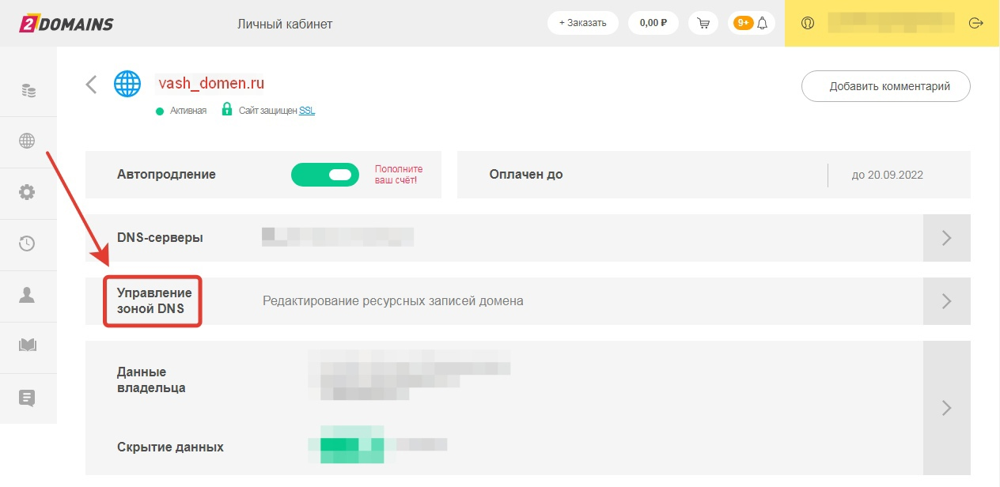
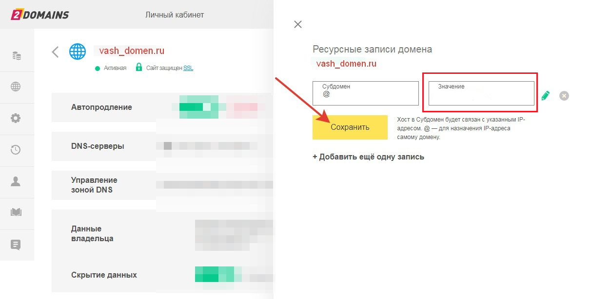

# Настройки сайта

Чтобы перейти в настройки сайта, нужно кликнуть на одноименную кнопку с шестеренкой в верхнем меню:

<figure><figcaption></figcaption></figure>

Или кликнуть на шестеренку на плашке сайта в разделе "Сайты":

<figure><figcaption></figcaption></figure>

Тогда справа откроется меню с настройками

<figure><figcaption></figcaption></figure>

## Основные

1. Название сайта

<figure><figcaption></figcaption></figure>

Отобразится на плашке с информацией о сайте.

2. Название вкладки в браузере

<figure><figcaption></figcaption></figure>

Отображается в названии вкладки браузера, в адресной строке и в результатах поисковых систем:

<figure><figcaption></figcaption></figure>

4. Описание сайта

<figure><figcaption></figcaption></figure>

Отобразится на плашке с информацией о сайте.

4. URL сайта - уникальный адрес сайта:

<figure><figcaption></figcaption></figure>

При клике на адресную строку на сайте отображается следующим образом:&#x20;

<figure><figcaption></figcaption></figure>

5. Иконка сайта&#x20;

<figure><figcaption></figcaption></figure>

По умолчанию иконка сайта - уникальное лого Сейлбот. При необходимости можно изменить иконку, загрузив собственное изображение:

<figure><figcaption></figcaption></figure>

Иконка будет отображена во вкладке:

<figure><figcaption></figcaption></figure>

#### Функции для многостраничных сайтов

Если вы создаете многостраничные сайты, то сможете назначить определенные страницы главными на сайте, добавить какие-либо страницы в футер или шапку сайта.&#x20;

<figure><figcaption></figcaption></figure>

Например, если вы создали страницу ошибки 404, то назначить ее отображение при ошибках на сайте можно в настройках.


Если вы назначили футер и хедер, то такие страницы будут отображаться на иных страницах сайта для вашего удобства, чтобы каждый раз заново не создавать один и тот же футер и (или) хедер на каждой странице.


## Как установить свой домен

При создании сайта в конструкторе каждому сайту присваивается домен со значением <mark style="color:blue;">**sbsite.pro**</mark>. В случае, если вам необходим уникальный домен или у вас уже есть собственный домен, то его можно установить в настройках сайта во вкладке "Домен".&#x20;

<figure><figcaption></figcaption></figure>

#### Alias-запись

Наиболее приоритетным вариантом для домена является ALIAS-запись - это ресурс специального типа в системах управления DNS, который позволяет связывать несколько разных доменных имен с одним IP-адресом.&#x20;

Такая запись позволит привязать ваш домен к Salebot, а также не допустить ошибок в работе сайта при изменении IP-адреса. Это значит, что в случае, если со стороны Salebot произойдет изменение IP, то работа вашего сайта никак не нарушится и он продолжит существовать без привязки к определенному айпи.

Alias-запись для сайта создается на ресурсе существования вашего домена - это может быть любой удобный для вас сервис.


Рекомендуем ознакомиться с инструкциями установления домена на стороне вашего регистратора во избежание ошибок.&#x20;


Далее при установлении домена, в поле со значением передайте sbsite.pro

<figure><figcaption></figcaption></figure>


При этом для домена, прикрепляемого к Salebot, **не должно быть AAAA и CNAME-записей**.&#x20;


После создания ALIAS записи со значением sbsite.pro, перейдите в настройки сайта, где необходимо установить ваш домен:

<figure><figcaption></figcaption></figure>

#### Как создать запись А


Запись А создается в исключительном случае: если ваш регистратор домена не поддерживает создание alias-записи.&#x20;


Запись А создаётся на стороне вашего домена.

Пример:

<figure><figcaption></figcaption></figure>

Далее в значение передайте IP - 84.201.187.29 (внутри России), международный - 188.166.193.161;&#x20;

<figure><figcaption></figcaption></figure>

После установки записи A дождитесь вступления в силу записи. Далее домен уже можно подключать к Salebot.


Если Вы видите ошибку "Не удалось создать сертификат", возможно вы сделали много попыток до этого. Подождите в течение часа и попробуйте снова.


На этом все. Все ссылки сайтов будут с вашим доменом.


Подтвержденный домен работает на всех созданных Вами сайтах.&#x20;


Домен будет работать по защищенному протоколу https

 (1) (1).png>)


SSL-сертификат создается автоматически


Чтобы отключить домен, удалите в настройках сайта.

Если вы видите эту ошибку, то переподключите домен.

<figure><figcaption></figcaption></figure>

## Действия

В настройках сайта во вкладке "Действия" существует возможность удалить сайт из вашего проекта:

<figure><figcaption></figcaption></figure>


Важно!

Сайты удаляются из проекта безвозвратно! Их нельзя восстановить!


**Чекбокс "Запретить индексацию сайта"** означает ограничить возможности поисковых систем добавлять страницы вашего сайта в свой поисковый индекс. В результате, ваш сайт не будет отображаться в результатах поиска. Это можно сделать, например, для временных страниц, страниц в разработке, или страниц с конфиденциальной информацией.

**Чекбокс "Скрыть надпись"** — скрывает надпись "Сделано в Сейлбот" в футере сайта.&#x20;


Сейлбот признательно благодарит всех пользователей, кто оставляет надпись "Сделано в Сейлбот" на своих сайтах!&#x20;

Вы помогаете нам стать лучше!


Поля для **ввода HTML и CSS-кода** понадобятся в случае, если вы являетесь уверенным знатоком-разработчиком с навыками написания собственного кода для добавления уникальных собственных элементов на сайт. В случае, если все же Вы мало знакомы с языками HTML и CSS, то понятные настройки помогут собрать любые элементы сайта без знания программирования.&#x20;


Подробнее об [HTML/CSS рассказали в разделе ниже](nastroiki-saita.md#html-css-js).


## Аналитика сайта

Во вкладке настроек "Аналитика" вы можете настроить счетчики для подсчета различных данных по пикселям, метрике и гугл аналитике:

<figure><figcaption></figcaption></figure>


О работе с Аналитикой на сайте подробно рассказали в [одноименной статье.](/broken/pages/w0cHPiRYe4dhJVn1ReVn)


## Шрифты и цвета

В настройках сайта во вкладке "Шрифты и цвета" можно подобрать цвет фона всего сайта, включая всего его страницы (если сайт многостраничный), а также выбрать цвета контейнера с секциями.

<figure><figcaption></figcaption></figure>

По умолчанию фон и цвет контейнера — белый. Можно сделать однотонный из цветового круга (нажмите на значок Пипетка) или выбрать Градиент (выберите плитку с понравившимся градиентом):

<figure><figcaption></figcaption></figure>

В том числе применительно ко всему сайту существует возможность выбрать необходимый шрифт, после чего уже не нужно будет настраивать шрифт в каждой отдельной секции в случае, если вам нужен единый стиль сайта.&#x20;

В отдельном случае, после установки общего шрифта для всего сайта в целом в любом блоке (секции) сайта вы сможете установить уникальный шрифт, например, для явного выделения данного блока (секции) среди прочих.

В случае, если вы не нашли необходимый шрифт в настройках, то можно загрузить свой собственный и при необходимости сделать его публичным (т.е. доступным для всех пользователей):

<figure><figcaption></figcaption></figure>

