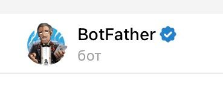
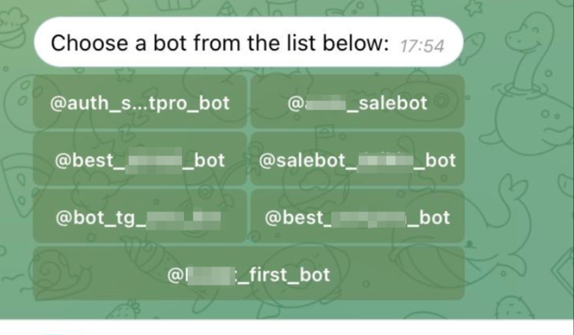
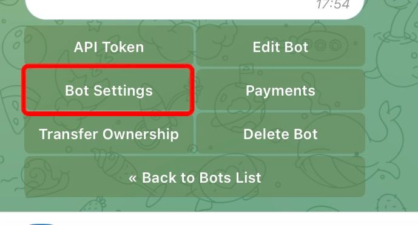
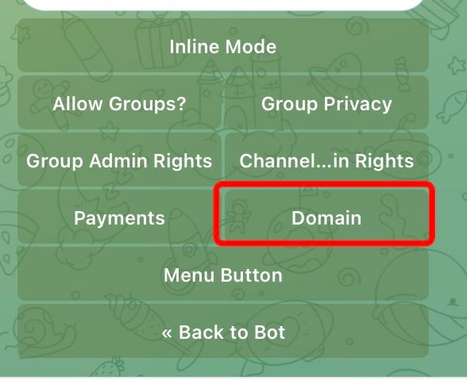
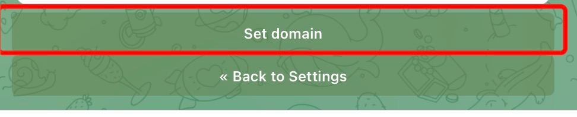
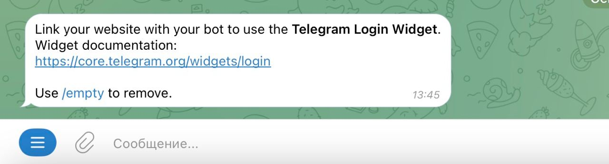

# Настройки страницы сайта

Для перехода к общим настройкам страницы нажмите кнопку "Настройки", находящуюся на верхней панели страницы <mark style="color:red;">**в режиме редактирования страницы**</mark>:

<figure><figcaption></figcaption></figure>

Тогда откроется меню с разделами настроек: основная информация, мессенджеры, аналитика, цвета/шрифты/HTML:

<figure><figcaption></figcaption></figure>

## **Информация о странице**

<figure><figcaption></figcaption></figure>

#### Название в списке

Здесь может быть любой ваш текст, поскольку название в списке страниц отображается для вас:

<figure><figcaption></figcaption></figure>

#### URL

Создано для того, чтобы вы могли указывать свою ссылку на страницу. По умолчанию, название генерируется автоматически из набора букв и цифр

<figure><figcaption></figcaption></figure>


Требования: \
\- могут быть использованы **только латинские буквы, цифры** и символ **нижнего подчеркивания( \_ )**\
\- название должно быть **уникальным в рамках платформы**. Если его уже выбрал кто-то другой, вам его использовать уже не удастся.


<figure><figcaption></figcaption></figure>


К сайту можно подключить свой домен. Если сменить название в ссылке не получается, значит это название уже занято. Можно добавить символы или выбрать другое.  &#x20;


#### **Название вкладки в браузере.**

По умолчанию Название вкладки в браузере равно значению в поле Название сайта, однако данное поле можно настроить по своему усмотрению: сделать название более лаконичным или наоборот:

<figure><figcaption></figcaption></figure>

Название вкладки в браузере отображается в адресной строке страницы:

<figure><figcaption></figcaption></figure>

### **Тег**

**Тег -** метка, которая передается в бот, как только пользователь перейдет в него по значку мессенджера. С помощью него можно запускать разные цепочки бота, не дожидаясь, пока пользователь что-то напишет. Для этого достаточно прописать тег в поле "Условие" в блоке с условием.


ТЕГ присваивается в настройках страницы.&#x20;


<figure><figcaption></figcaption></figure>


Значение, указанное в поле Тег, будет записано в переменную клиента tag. В дальнейшем можно использовать данную переменную в аналитике.&#x20;


При получении сообщения, содержащего заданный тег, бот автоматически распознает его как сигнал к запуску определенного этапа воронки. Это может включать в себя отправку ответного сообщения, переход к следующему этапу воронки или прекращение работы воронки в зависимости от контекста и логики схемы чат-бота.

Укажите тег, например:

<figure><figcaption></figcaption></figure>

После сохранения настроек Тег можно увидеть на плашке вашей страницы:

<figure><figcaption></figcaption></figure>

**Пример использования тега в мессенджере.**

В настройке сайта указан тег  - основная воронка.

<figure><figcaption></figcaption></figure>

Далее вам необходимо указать тег в настройках блока в схеме чат-бота:

<figure><figcaption></figcaption></figure>

Можно настроить логику бота с указанного блока, например, переход в основную воронку.&#x20;

Пользователь на сайте нажимает кнопку мессенджера и переходит в него:

<figure><figcaption></figcaption></figure>


О настройке блока с формой и кнопками в мессенджер, рассказали в статье "[Ответы форм](/broken/pages/YOzidl4HYJaWmkPXnuYY#nastroika-kontenta-podrazdel-sozdat-vopros)" в разделе настройка контента.&#x20;


При клике на кнопку пользователю предлагается перейти непосредственно в мессенджер:

<figure><figcaption></figcaption></figure>

**Путь клиента на примере Telegram:**\
\- Перешел с сайта в Telegram:

<figure><figcaption></figcaption></figure>

\- Нажал кнопку "Запустить"/"Старт" (зависит от устройства). Даже если клиент ранее контактировал с ботом для запуска бота с сайта он должен нажать кнопку Запустить. _Это правила мессенджера для ботов._

<figure><figcaption></figcaption></figure>

\- В бота вместо /start придет тег, указанный в настройках сайта.

<figure><figcaption></figcaption></figure>

\- Клиенту приходит первое сообщение из воронки, запуск которой настроен на данный тег.

\- В карточке клиента указана переменная:

<figure><figcaption></figcaption></figure>

Чтобы просмотреть аналитику по тегу, необходимо перейти в раздел "Аналитика", вкладку "Клиенты":

<figure><figcaption></figcaption></figure>

Далее создайте новый виджет, где укажите основные настройки:

1. Период Аналитики: за месяц, за все время и пр;
2. Название виджета: любое удобное название;
3. Укажите тег.

<figure><figcaption></figcaption></figure>

Далее добавьте виджет.


Готово! Теперь вы сможете отслеживать статистику запуска ботов с сайта с помощью тега.&#x20;



С помощью аналитики вы сможете отслеживать конверсии, работу операторов, статистику по курсам, клиентам и многое другое совершенно бесплатно без подключения сторонних ресурсов и интеграций!&#x20;

Подробнее об иных возможностях раздела "Аналитика" читайте в статье "[Аналитика Salebot](/broken/pages/wYAWtCPmmg5M9uDmeUPE)".


## Настройка изображений

<figure><figcaption></figcaption></figure>

#### Иконка страницы

Иконка отображается в браузере во вкладке перед названием страницы и в качестве картинки рядом с закладкой.

<figure><figcaption></figcaption></figure>


Рекомендуемый формат ico, png размером не более 150px.&#x20;


#### Превью сайта

Превью - это заставка или обложка для предварительного просмотра сайта.&#x20;

По умолчанию в превью для сайта используется первое изображение с его страницы, поэтому если вы хотите изменить превью, загрузите новое изображение в данное поле:

<figure><figcaption></figcaption></figure>

## **Настройка защиты сайта / reCAPTCHA**

<figure><figcaption></figcaption></figure>

Для установки reCAPTCHA нужно указать пару ключей (публичный и секретный ключи) в общих настройках сайта и в формах включить проверку recaptcha.

Вы можете выбрать любой сервис, который поставляет защиту сайтов с помощью капчи. В разделе рассмотрим, как установить капчу от гугла.

1. Получение ключей

<figure><figcaption></figcaption></figure>

Для начала вам необходимо заполнить основную информацию для получения ключей: выбрать типы капчи; добавить домен сайта, на котором планируется установить защиту. Далее необходимо кликнуть "отправить".&#x20;

2. Ввод ключей

<figure><figcaption></figcaption></figure>

Далее вы увидите пару ключей, которые необходимо скопировать и вставить в настройках страницы сайта в Сейлботе:

<figure><figcaption></figcaption></figure>

3. Включение капчи в секции "Форма"


Как создать и работать с секцией "Форма" рассказали в статье [здесь](/broken/pages/YOzidl4HYJaWmkPXnuYY).&#x20;


После того как вы настроили секцию "Форма" на сайте, перейдите в настройки секции:

<figure><figcaption></figcaption></figure>

После клика на кнопку "Настройки" справа откроется меню:

<figure><figcaption></figcaption></figure>

Где вы увидите чекбокс для включения капчи.&#x20;

## **Аутентификация**

Эта опция позволит отсеять тех, кто пытается просто попасть на сайт без авторизации, но лучше включать ее после настройки всего остального, когда будете уверены что все настроено верно. После ее включения попасть на сайте можно только через кнопку для авторизации, которую отправляет бот.&#x20;

<figure><figcaption></figcaption></figure>

Для начала привяжем домен к подключенному в проекте Telegram-боту.&#x20;

Шаг 1. Перейдите в BotFather, в котором вы создавали своего телеграм-бота:

<figure><figcaption></figcaption></figure>

Шаг 2. Выберите телеграм-бота, которого Вам необходимо подключить к сайту, и кликните на него:

<figure><figcaption></figcaption></figure>

Шаг 3. Перейдите в настройки телеграм-бота:

<figure><figcaption></figcaption></figure>

Шаг 4. В настройках бота перейдите к домену:

<figure><figcaption></figcaption></figure>

Шаг 5. Кликните на "Установить домен"&#x20;

<figure><figcaption></figcaption></figure>


Если вы уже подключали домен к боту либо Вам понадобится установить новый домен к тому же боту, вместо кнопки "Set domain" будет - "Reset domain".&#x20;


Шаг 6. Отправьте боту домен, который хотите подключить к телеграм-боту: для этого в поле строки сообщения введите домен:&#x20;

<figure><figcaption></figcaption></figure>

Это может быть как ваш личный домен, который вы получали в регистраторе доменных имен, либо вида sbsite.pro&#x20;

На данном этапе привязка домена завершена.&#x20;

После привязки домена к боту, активируйте в настройках формы чекбокс "Требовать авторизацию через Telegram":

<figure><figcaption></figcaption></figure>

## Настройки интерфейса и доступа

<figure><figcaption></figcaption></figure>

**Доступ только по спискам**

Эта опция позволяет предоставить доступ к сайту по наличию пользователя в определенных списках вашего проекта.&#x20;

#### **Скрыть надпись "Сделано в Salebot"**

&#x20;При необходимости надпись можно скрыть. Для этого поставьте галочку в данном чек-боксе.&#x20;

<figure><figcaption></figcaption></figure>


Скрыть надпись "Сделано в Salebot" можно на любом платном тарифе.

Мы благодарны всем, кто оставляет надпись "Сделано в Salebot" на своих страницах.


## HTML/CSS/JS

<figure><figcaption></figcaption></figure>

Заполнять данный раздел можно по необходимости. \
Если вы понимаете в CSS, то сможете сделать свой сайт еще привлекательнее. Также сюда можно вставить код сервиса аналитики, пикселя от Facebook и пр.

<figure><figcaption></figcaption></figure>


ОБРАТИТЕ ВНИМАНИЕ!

При копировании примеров скрипта обращайте внимание, что если теги открываются, значит они должны и закрываться: &#x20;

Например, \<script> ........ \</script> , \<style> ........\</style>


### Сменить ссылку на политику конфиденциальности

В блоке Форма заявки с кнопками мессенджеров можно отобразить чекбокс Политики конфиденциальности. По умолчанию указана политика конфиденциальности конструктора.&#x20;

С помощью скрипта можно сменить ссылку на страницу с политикой конфиденциальности.


Добавьте скрипт в поле html-код body в разделе CSS и JS


```
<script>
document.getElementsByClassName('salebot-privacy__link')[0].href = "ссылка на политику конфиденциальности";
</script>
```

### Убрать индексацию страницы

Чтобы убрать индексацию страницы добавьте скрипт в поле html-код head

```
<meta name="robots" content="noindex, nofollow">
```

<figure><figcaption></figcaption></figure>

### Удалить кнопку ВК со страницы сайта


Добавьте скрипт в поле html-код body в разделе CSS и JS


```javascript
<script>
document.getElementsByClassName('vk_link')[0].remove()
</script>
```

### Убрать заголовок страницы сайта


Добавьте скрипт в поле html-код body в разделе CSS и JS\
Подходит для старых версий минилендингов


```javascript
<script>
document.getElementsByClassName('title_container')[0].remove()
</script>

```

### Изменить ссылку в кнопке Telegram


Добавьте скрипт в поле html-код body в разделе CSS и JS


```javascript
<script>
window.onload = function() {
    let button = document.querySelector('.tg_link')
    if (button) {
        button.setAttribute('data-url', 'нужное значение')
        button.removeAttribute('onclick')
        let newUrl = button.getAttribute('data-url')
        button.addEventListener('click', () => {
            window.location.href = newUrl
        })
    }
}
</script>
```

Для других мессенджеров замените tg\_link на insta\_link, vk\_link и т.д.

### Изменить текст кнопки


Разместите данный код в поле **HTML-код body** в разделе CSS и JS


1. Для отображения кнопки мессенджера создайте блок форму заявок с вопросами и укажите на какие мессенджеры следует вывести кнопки.

Установите **стиль** отображения кнопок - **Иконка с текстом**:

<figure><figcaption></figcaption></figure>


Подробнее о секции форма, рассказали [тут](/broken/pages/YOzidl4HYJaWmkPXnuYY).&#x20;


2. В разделе Настройки сайта на вкладке **CSS и JS** разместите в поле **Настройки HTML** -> **HTML-код body** следующий код:

<pre class="language-javascript"><code class="lang-javascript">&#x3C;style>
.tg_link {
font-size: 0 !important;
padding: 15px 15px !important;
}
.viber_link {
font-size: 0 !important;
padding: 15px 15px !important;
}


<strong>.tg_link:after {content: "Зарегистрироваться в Telegram";font-size: 15px;color: white}
</strong>.viber_link:after {content: "Зарегистрироваться в Viber";font-size: 15px;color: white}
&#x3C;/style>
</code></pre>

Данный код изменит текст кнопок для Telegram и Viber. Для других мессенджеров внесите код по аналогии с примером.

### Установить кнопки в ряд

Укажите скрипт в поле JS-код основных настроек минилендинга следующий скрипт:

```
$(function() {
$('.link_group').css("flexWrap", 'noWrap')
})
```

<figure><figcaption></figcaption></figure>

### Изменить фавикон


Добавьте скрипт в поле **html-код head** в разделе CSS и JS


Данный код можно использовать изменения фавикона - значка веб-сайта или веб-страницы.

<pre class="language-html"><code class="lang-html"><strong>&#x3C;link rel="shortcut icon" type="image/x-icon" href="ссылка на иконку" />
</strong></code></pre>

#### Передать все переменные, с которыми открылся сайт&#x20;


Скрипт нужно разместить на всех страницах ВАШЕГО сайта, где есть прокси ссылка. Скрипт должен быть размещен **после тега body**.

Если вы используете свой домен для прокси ссылок, sbsite.pro надо будет заменить на него.


Если на ваш сайт добавлены прокси-ссылки на мессенджеры со страницы сайта, можно добавить этот скрипт, тогда все переменные, с которыми открылся сайт, будут переданы в бота.&#x20;

```javascript
<script>
var links = document.getElementsByTagName("a")
for (let i of links) {
    if (i.href.startsWith("https://sbsite.pro/")) {
        if (i.href.split("?").length > 1) {
            i.href += "&" + location.search.split("?")[1]
        } else {
            i.href += location.search
        }
    }
}</script>
```

### Передать в бота куки аналитики


Скрипт нужно разместить на всех страницах ВАШЕГО сайта, где есть прокси ссылка. Скрипт должен быть размещен **после тега body**.

Если вы используете свой домен для прокси ссылок, sbsite.pro надо будет заменить на него.


Если вам необходимо пробросить в бота куки аналитики, разместите на сайт следующий скрипт:

```javascript
<script>
setTimeout(function() {
    var links = document.getElementsByTagName("a");
    var cookies = ['_fbc', '_fbp', '_ga', '_ym_uid', 'roistat_visit'];
    var cookies_string = '';

    cookies.forEach(function(cookie_name){
        let cookie_val = get_cookie(cookie_name);
        if (cookie_val !== undefined) {
            cookies_string += (cookies_string != '' ? "&" : '') + cookie_name + "='" + cookie_val + "'";
        }
    });

    for (let i of links) {
        if (i.href.startsWith("https://sbsite.pro/")) {
            if (i.href.split("?").length > 1) {
                i.href += "&" + cookies_string;
            } else {
                i.href += "?" + cookies_string;
            }
        }
    }

    function get_cookie(name) {
        let matches = document.cookie.match(new RegExp("(?:^|; )" + name.replace(/([\.$?*|{}\(\)\[\]\\\/\+^])/g, '\\$1') + "=([^;]*)"));
        return matches ? decodeURIComponent(matches[1]) : undefined;
    }
}, 3000);
</script>
```

### Изменить ссылку на политику конфиденциальности


На вкладке **CSS и JS** разместите в поле **Настройки HTML** -> **HTML-код body** следующий код:


С помощью данного скрипта можно заменить ссылку на политику конфиденциальности на свою:

```
<script>
document.getElementsByClassName('salebot-privacy__link')[0].href = "ссылка на политику";
</script>
```

### Изменить ссылку в кнопке Telegram

Добавьте скрипт в поле html-код body в разделе CSS и JS:

`<script>`

`document.getElementsByClassName('modern_btn salebot_button tg_link')[0].href = "новая ссылка";`

`</script>`

Если вам необходимы другие мессенджеры, то замените tg\_link на insta\_link, vk\_link и т.д.
