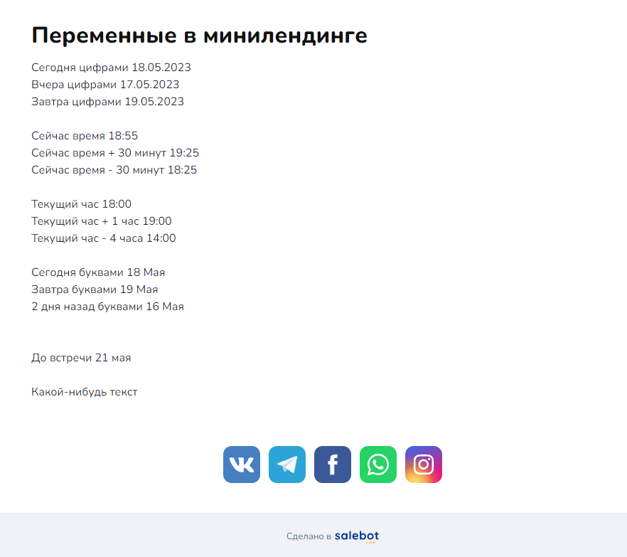
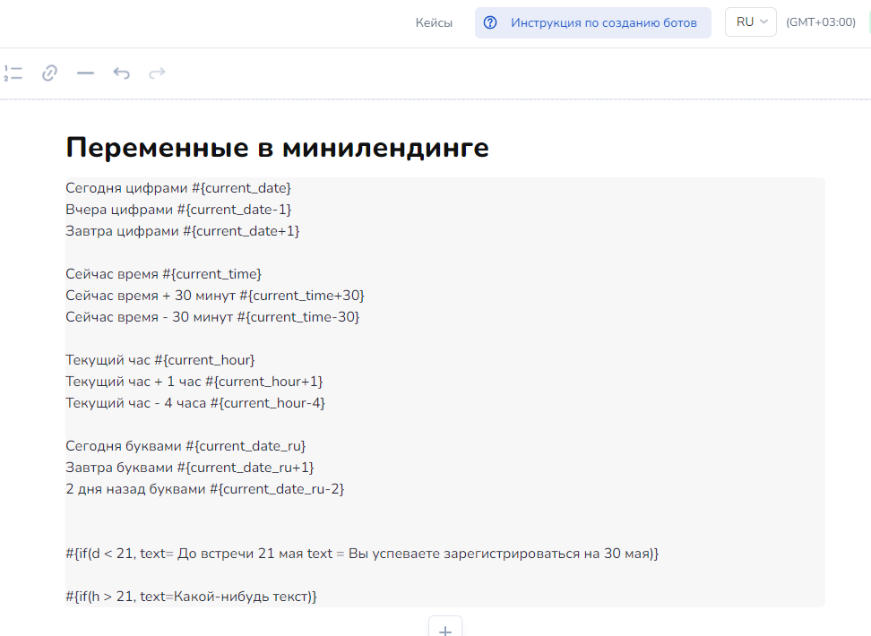

# Переменные для сайта

## Как работать с переменными для сайта и лендинга

### Как работать с датой и временем

\#{**current\_time**} - текущее время в формате hh:mm\
\#{**current\_date**} - сегодняшняя дата в формате dd:mm:yyyy\
\#{**current\_date\_ru**} - сегодняшняя дата в формате dd _название месяца_

**#{current\_hour}** - текущий час +- указанное количество часов

**#{text}&#x20;**<mark style="color:orange;">**для конструкции с проверкой условия if**</mark> - выводит текст при соблюдении условия. Пример можно увидеть [👉здесь](peremennye-dlya-saita.md#kak-ispolzovat-uslovnyi-operator-if)

Данный текст выведен с использованием переменных и математическими действиями: сложением и вычитанием времени и даты.&#x20;

Оригинал:

`Сегодня цифрами #{current_date}` \
`Вчера цифрами #{current_date-1}`\
`Завтра цифрами #{current_date+1}` \
`Сейчас время #{current_time}` \
`Сейчас время + 30 минут #{current_time+30}` \
`Сейчас время - 30 минут #{current_time-30}` \
`Сегодня буквами #{current_date_ru}` \
`Завтра буквами #{current_date_ru+1}` \
`2 дня назад буквами #{current_date_ru-2}`\
`Текущий час #{current_hour}`  _(если сейчас  14:53, выведет 14:00)_\
`Текущий час + 1 час #{current_hour+1}` _(если сейчас  14:53, выведет 15:00)_\
`Текущий час - 4 часа #{current_hour-4}` _(если сейчас  14:53, выведет 10:00)_

<figure><figcaption></figcaption></figure>

<figure><figcaption></figcaption></figure>

### Как использовать условный оператор if

**`#{if(<условие>, <значение при истине>, <значение при лжи (необязательно)>)}`** - выводит переменные при определенном условии

В качестве условия может быть **h - часы и d - дни,**  которые сравниваются операторами сравнения (<, >, ==, >=, <=, !=). \
\
Например, если сейчас 20 часов, то #{if(h>15, current\_date+1, current\_date)}

После сравнения можно вывести разный текст, для этого используйте переменную **text:**

`#{if(h > 21, text=Какой-нибудь текст)}`&#x20;

_На минилендинге будет показано значение переменной text, если текущее ВРЕМЯ больше 21:00 (учитывается время проекта)_


ВАЖНО! Чтобы переменная работала корректно пишем переменную БЕЗ пробела перед знаком равно:  text=&#x20;



Можно вставить два text= через пробел или Enter . Первый это тот который сработает если условие верно, второй если неверно


`#{if(d < 21, text= До встречи 21 мая, text= Вы успеваете зарегистрироваться на 30 мая)}`&#x20;

_На минилендинге будет показано значение "До встречи 21 мая" , если текущая дата (d<21) меньше 21 числа текущего месяца.  Если дата уже больше 21, то будет показан второй вариант значения text = Вы успеваете зарегистрироваться на 30 мая_

### Как получить день недели

\#{weekday\_date(номер дня недели)} - дата ближайшего указанного дня недели в формате dd&#x20;

1 - понедельник, 7 - воскресенье

### Как использовать свои переменные в постах ВКонтакте

Вы можете использовать свои собственные переменные при публикации постов Вконтакте. Для этого необходимо использовать функцию **quizlink()** и выполнить настройку автоматического поста ВК

## Как использовать в Минилендинге Html - код

Если вам необходимо изменить минилендинг под свои нужды, Вы можете добавить скрипт в поле html-код body, который сделает нужные изменения.&#x20;


Из-за правил Вконтакте HTML - код не вставится в минилендинг ВКонтакте


Например, скрипт ниже удаляет кнопку ВК с минилендинга.

```javascript
<script>
document.getElementsByClassName('vk_link')[0].remove()
</script>
```

Данный скрипт убирает заголовок минилендинга

```javascript
<script>
document.getElementsByClassName('title_container')[0].remove()
</script>

```

Например, скрипт ниже меняет ссылку кнопки телеграмма.

```javascript
<script>
document.getElementsByClassName('salebot_button tg_link')[0].href = "новая ссылка";
</script>
```

для других мессенджеров insta\_link, vk\_link и т.д
