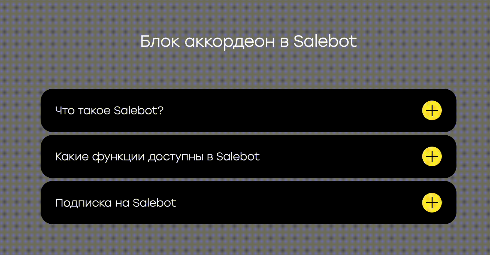

# Секция "Аккордеон"

Блок "Аккордеон" представляет собой удобное графическое решение для сайта в виде списка текстовых заметок с выпадающими элементами:

<figure><figcaption></figcaption></figure>

"Аккордеон" достаточно просто внедрить на сайт и настроить под собственные нужды: он может отлично вписаться под любые необходимые запросы. &#x20;

## Как добавить и настроить "Аккордеон"?

Чтобы добавить элемент в ваш сайт, перейдите в настройки сайта и нажмите плюс, чтобы открыть меню с доступными в Сейлбот секциями

<figure><figcaption></figcaption></figure>

Затем в открывшемся меню с секциями найдите блок "Аккордеон":

<figure><figcaption></figcaption></figure>

Далее вы увидите добавленный пустой блок, в котором необходимо настройки контент в виде карточек и вида самих карточек аккордеона:

<figure><figcaption></figcaption></figure>

## Настройка контента

Для начала добавим карточки контента, для чего необходимо кликнуть на кнопку "Контент", а затем добавить саму карточку, в которой будет лежать заголовок и соответственно текст:

<figure><figcaption></figcaption></figure>

В ваш контент добавилась пустая карточка,  в которую можно добавить текст-вопрос, изображение и текст-ответ:

<figure><figcaption></figcaption></figure>

Для текстового элемента блока предусмотрены настройки, аналогичные настройкам любого текстового редактора: настройки жирности, курсива, подчеркивания, высоты и начертания шрифта, цвета и прочее. \
Чтобы применить к тексту его настройки, выделите необходимую часть текста и выберите текстовые настройки:

<figure><figcaption></figcaption></figure>

Далее прогрузите при необходимости изображение и добавьте уточняющий текст - ответ на вопрос:

<figure><figcaption></figcaption></figure>

Можно добавить необходимое количество карточек контента:&#x20;

<figure><figcaption></figcaption></figure>

## Кастомизация контента

После того, как вами было добавлено необходимое количество карточек контента, переходите в настройки контента:

<figure><figcaption></figcaption></figure>

Далее можно выбрать чекбокс, чтобы была открыта первая карточка аккордеона или только одна из карточек:

<figure><figcaption></figcaption></figure>

Далее выберите настройку вертикального отступа между вопросами блока:

<figure><figcaption></figcaption></figure>

Также углы карточек можно скруглить с помощью данного поля, принимающего только числовые значения:

<figure><figcaption></figcaption></figure>

Текстовый элемент (как и кнопка) в карточке всегда находится посередине относительно верхнего и нижнего края. Чтобы выбрать необходимое расстояние, введите числовое значение в поле "Внутренний отступ сверху и снизу":

<figure><figcaption></figcaption></figure>

Также весь контент карточки (включая текст и кнопку для развертывания текста-ответа) находится посередине относительно правого и левого края. Чтобы настроить отступы слева и справа, воспользуйтесь полем "Внутренний отступ слева и справа":

<figure><figcaption></figcaption></figure>

Чтобы выбрать размер иконки, по нажатию на которую открывается текст-ответ, достаточно воспользоваться данным полем "Ширина иконки", который также принимает исключительно числовое значение:

<figure><figcaption></figcaption></figure>

Если внутри карточки изображение слишком большое, то можно выбрать его ширину, указав необходимое значение в поле "Ширина изображения":

<figure><figcaption></figcaption></figure>

Далее выберите цветовую палитру для каждого элемента своего аккордеона: текста, фона карточки, иконки и т.п.:

<figure><figcaption></figcaption></figure>

Теперь вы знаете, как устанавливать блок "Аккордеон" на свой сайт и настраивать контент внутри блока.&#x20;

## Кастомизация блока (секции): настройки шрифтов, фона и отображения

Для кастомизации блока "Аккордеон" вам понадобятся универсальные настройки секции (блоков), в которые входят настройки шрифтов, фона и отображения.

<figure><figcaption></figcaption></figure>

Настройки секции (блока), а именно шрифтов, фона и отображения одинаковые для всех блоков.&#x20;


Подробнее об универсальных настройках секций (блоков) сайта [читайте в одноименной статье.](/broken/pages/oX6Y9RGmKT74x44vZ8gr)&#x20;

