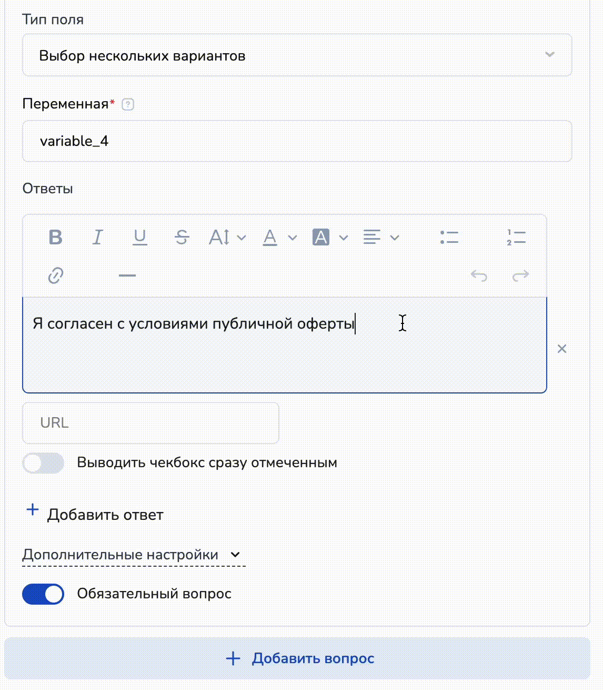
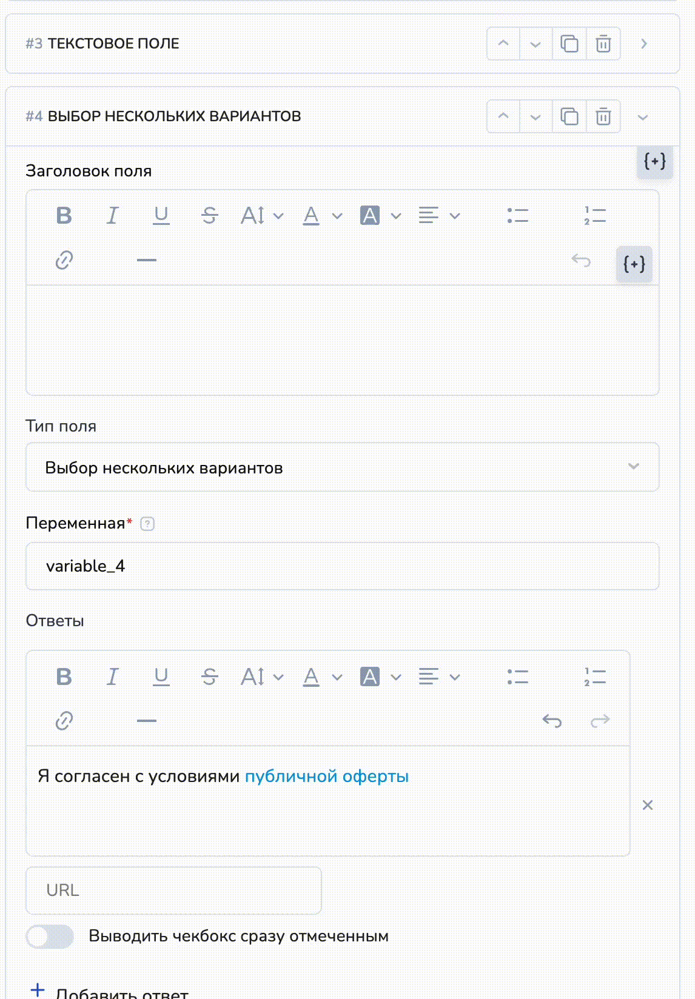

# Секция "Форма"

Данный блок позволяет добавить форму для сбора данных, например, телефон, имя, ответы на вопросы и прочее и установить кнопки для перехода в мессенджеры в чат-бота.

Вы легко можете настраивать внешний вид кнопок мессенджеров, используя штатные настройки кнопок этого блока.

<figure><figcaption></figcaption></figure>

## Как создать Форму для сбора заявок

При добавлении формы, благодаря предустановленным настройкам в форме создаются сразу три типа поля для сбора данных:

1\) Имя;

2\) Email;

3\) Номер телефона.

<figure><figcaption></figcaption></figure>

Если нужно добавить в форму иные вопросы,  то нажмите кнопку "Добавить еще вопрос":

<figure><figcaption></figcaption></figure>


Поля **Вопрос** и **Переменная** являются обязательными для ввода и помечены \*.


<figure><figcaption></figcaption></figure>

Чтобы перейти в настройки вопроса, кликните по стрелке на плашке вопроса:

<figure><figcaption></figcaption></figure>

Тогда вы увидите развернутые настройки для вопроса:

<figure><figcaption></figcaption></figure>

переключатель **Обязательный вопрос**&#x20;

Вопрос можно сделать обязательным. В этом случае, пока пользователь не введет значение перехода в мессенджеры не произойдет.  Для этого активируйте чекбокс Обязательный вопрос:

<figure><figcaption></figcaption></figure>

**Удалить вопрос** можно нажав на значок корзины, напротив переключателя Обязательный вопрос:

<figure><figcaption></figcaption></figure>

**кнопка Добавить еще вопрос**

Если необходимо задать несколько вопросов в одной форме, то можно добавлять вопросы, кликнув по кнопке Добавить ещё вопрос.

При клике по кнопке Задать вопросы открывается форма по умолчанию с типом поля Выпадающий список. Дальше его можно сменить на любой из доступных.&#x20;

**Тип поля.** Можно выбрать один из вариантов доступных вопросов:

* **Выпадающий список** - перечень ответов будет выведен на экран в виде поля со списком
* **Выбор нескольких вариантов** - ответ может содержать несколько вариантов - множественный выбор из перечня возможных ответов
* **Выбор одного варианта** - может быть выбран только один ответ из перечня возможных ответов
* **Текстовое поле** - поле, в котором клиент должен ввести значение самостоятельно

Следующие типы полей могут быть использованы в форме только один раз для настоящего минилендинга:

* **Имя**&#x20;
* **Email**
* **Телефон**

Если вопрос отмечен **обязательным**, то клиент не сможет закрыть форму, не ответив на данный вопрос.

#### тип поля Выпадающий список

В данном вопросе возможные варианты ответов спрятаны в выпадающем меню. При клике по полю откроется меню с вариантами ответов. Добавить новый ответ можно кликнув по кнопке Добавить ответ.

Также данная функция предусматривает возможность добавлять "Свой ответ" в вопрос "Выбор одного из вариантов" - это позволит получать от клиентов не только ответы, установленной формы, но и узнать новые варианты, которые могли придумать пользователи.

В поле Переменная необходимо указать название переменной с учетом рекомендаций к их созданию. Ответ будет сохранен в переменную и передан в бота. &#x20;

<figure><figcaption></figcaption></figure>

#### тип поля Текстовое поле

Можно выбрать данный тип, если пользователь должен указать ответ в  свободной форме.&#x20;

В поле Переменная необходимо указать название переменной с учетом рекомендаций к их созданию. Ответ будет сохранен в переменную и передан в бота. &#x20;

<figure><figcaption></figcaption></figure>

#### тип поля Выбор нескольких вариантов

В данном вопросе пользователь может выбрать как один так и несколько вариантов ответа. На странице минилендинга отображаются сразу все ответы. Рядом с ними стоят квадратные чекбоксы для выбора.\
\
Добавить новый ответ можно кликнув по кнопке + Добавить ответ.

В поле Переменная необходимо указать название переменной с учетом рекомендаций к их созданию. Ответ будет сохранен в переменную и передан в бота. &#x20;

<figure><figcaption></figcaption></figure>

#### тип поля Выбор одного варианта

В данном вопросе пользователь может выбрать только один вариант ответа из доступных. На странице минилендинга отображаются сразу все ответы. Рядом с ними стоят круглые чекбоксы, но выбрать можно только один ответ.\
\
Добавить новый ответ можно кликнув по кнопке + Добавить ответ.

В поле Переменная необходимо указать название переменной с учетом рекомендаций к их созданию. Ответ будет сохранен в переменную и передан в бота. &#x20;

<figure><figcaption></figcaption></figure>

#### тип поля: Имя

В данное поле записывается имя пользователя. При переходе в бота имя с сайта запишется в переменную клиента **`name_from_ml`**

<figure><figcaption></figcaption></figure>

**Надпись**. Если не заполнять данное поле,  то над полем ввода номеру будет указано по умолчанию _Имя._ Можно ввести своё описания для того, чтобы пользователь ввёл свои данные.

Как отображается полученное на сайте имя клиента:

.png>)

#### тип поля: Email

В данное поле записывается электронный адрес пользователя. При переходе в бота имя с сайта запишется в переменную клиента **`email`**

<figure><figcaption></figcaption></figure>

**Надпись**. Если не заполнять данное поле,  то над полем ввода номеру будет указано по умолчанию _Email._ Можно ввести своё описания для того, чтобы пользователь ввёл свои данные.

Как отображается полученные данные в боте при переходе с минилендинга:

.png>)

#### тип поля: Телефон

В данное поле записывается номер телефона пользователя. При переходе в бота телефон пользователя с сайта запишется в переменную клиента **`phone`**

.png>)

На минилендинге есть дополнительные настройки.

**Кастомные телефоны**. Можно укажите какие коды стран показать для выбора при вводе номера телефона.&#x20;

<figure><figcaption>
Кастомные (настраиваемые) коды стран. 
</figcaption></figure>

**Код страны по умолчанию** указан +7 Россия. в этом поле можно сменить этот код на другую страну при необходимости.

Переключатель **Определение кода страны по ip адресу.**

<figure><figcaption>
Определение кода страны по ip адресу
</figcaption></figure>

При включении переключателя "Определение кода страны по ip адресу" код страны определяется автоматически по номеру телефона из базы ip (поле 1 на скрине, "Кастомные телефоны"). Если код страны не найден, то ставится код, указанный в поле "Код страны по умолчанию" (поле 2 на скрине выше).&#x20;

Таким образом, если в поле "Кастомные телефоны" указать, например: Казахстан, и  включить автоопределение кода страны по ip адресу, то сначала будет произведен поиск кода по номеру телефона из базы Кастомные телефоны (ip-адресов). Если номер найден, то возьмется код страны из номера телефона, иначе из поля "Код страны по умолчанию", т.е. Код страны по умолчанию.


В связи с временными ограничениями на уровне стран, данная настройка может работать не корректно.&#x20;


**Надпись**. Если не заполнять данное поле,  то над полем ввода номеру будет указано по умолчанию _Телефон._ Можно ввести своё описания для того, чтобы пользователь ввёл свой номер телефона.

&#x20;

<figure><figcaption>
Пример настройки Надписи над номером телефона
</figcaption></figure>

## Как создать форму в кнопке


Данная функция не работает для страницы подписки ВКонтакте. Форма будет добавлена на страницу автоматически.


В данном случае воспользуемся секцией pop-up.


Подробнее о секции pop-up [рассказали в одноименной статье.](/broken/pages/hxO6OwzOdQPIjJgFHJXc)&#x20;


Перейдите в режим редактирования страницы сайта и найдите кнопку "+", чтобы добавить секцию "Pop-up":

<figure><figcaption></figcaption></figure>

Тогда секция будет добавлена на страницу сайта:

<figure><figcaption></figcaption></figure>

Теперь необходимо заполнить pop-up — для этого нажмите соответствующую кнопку в секции:

<figure><figcaption></figcaption></figure>

Далее выберите секцию, которую хотите добавить в pop-up — это секция "Форма":

<figure><figcaption></figcaption></figure>

При клике форма добавится в pop-up, а справа откроется окно для заполнения контента формы:

<figure><figcaption></figcaption></figure>

Теперь заполните контент формы так, как описано в разделах выше.

<figure><figcaption></figcaption></figure>


В pop-up можно добавить любое количество секций, тем самым сделав мини-сайт, который открывается при клике на кнопку.


Теперь укажем ID pop-up в качестве ссылки в кнопке (кнопка может быть любой):

<figure><figcaption></figcaption></figure>

Далее перейдем к секции меню (шапка страницы сайта) и укажем значение pop-up в кнопке с функцией ссылка:

1. Кликните на "Редактировать" в необходимой секции (это может быть как секция "Меню", так и секция "Кнопки"):

<figure><figcaption></figcaption></figure>

Тогда откроется правый бар с редактированием контента:

<figure><figcaption></figcaption></figure>

2. Далее создайте кнопку с функцией "Ссылка":

<figure><figcaption></figcaption></figure>


Важно!

Действие — "В текущем окне", иначе кнопка pop-up не откроется.


Готово! Теперь вы сможете открывать форму через кнопку меню или другую кнопку на странице сайта:

<figure><figcaption></figcaption></figure>

### Как добавить сделку в SalebotCRM с сайта


Работает только если подключен к проекту канал Whatsapp или email: проверит есть ли клиент в базе и добавит  ему новую сделку или будет создан новый клиент и сделка для него.

Если подключены оба канала, создается клиент Whatsapp!


<figure><figcaption></figcaption></figure>

## Обработка ПДн и Политика конфиденциальности

В форме по умолчанию существуют настройки для добавления чекбоксов "Я согласен на обработку персональных данных" и "Политика конфиденциальности":

<figure><figcaption></figcaption></figure>

Чтобы добавить на лендинг (сайт) чекбоксы для согласия с обработкой персональных данных или с политикой конфиденциальности в форму, просто включите чекбоксы и добавьте ссылку на  файлы с политикой и с согласием:

<figure><figcaption></figcaption></figure>

По умолчанию данные настройки отключены.


Обращаем внимание!

Настоятельно не рекомендуем включать поля "Выводить чекбокс сразу отмеченным", поскольку ваш клиент должен самостоятельно проставить согласия в вашей форме.


После того как вы включите в форму согласия, они сразу отобразятся в секции "Форма" под полями ввода в форме:

<figure><figcaption></figcaption></figure>

## Как добавить дополнительные поля согласий?

Например, Вам необходимо, помимо согласия на обработку ПДн, собрать согласие клиента на отправку ему рассылок или согласие с публичной офертой.

<figure><figcaption></figcaption></figure>

Сделать это также просто с помощью кнопки "Добавить вопрос":

<figure><figcaption></figcaption></figure>

Далее выберите тип "Выбор нескольких вариантов" и в поле "Ответы" пропишите "Я согласен с условиями публичной оферты".

<figure><figcaption></figcaption></figure>

Далее активируйте переключатель "Обязательный вопрос".&#x20;

Теперь укажем ссылку на документ прямо в тексте:

<figure><figcaption></figcaption></figure>

Для этого выделите необходимую часть текста (или весь текст) в поле и кликните на значок ссылки. В открывшемся поле нужно указать вашу ссылку на документ.

Теперь добавим следующий чекбокс "Я согласен на отправку рекламных сообщений" аналогичным образом:

<figure><figcaption></figcaption></figure>


Обращаем внимание!

Настоятельно рекомендуем дополнительные чекбоксы в форме для сбора согласий (с публичной офертой, с рекламной рассылкой, с получением информации и т.д.) создавать отдельными вопросами:

1. Это поможет отображать сбор согласий в таблице ответов в каждом отдельном поле (то есть в таблице с ответами вы увидите, что ваш клиент поставил галочку напротив согласия) и сможете выгрузить данную таблицу в будущем с подтверждением согласия Вашего клиента;
2. Тип поля "Выбор нескольких вариантов", если сразу проставить все необходимые чекбоксы с согласиями, позволит согласиться пользователям только с каким-либо из предложенных вариантов, поэтому если оказание Ваших услуг невозможно без всех согласий, создайте один вопрос с одним ответом.


Пример заполненной формы:

<figure><figcaption></figcaption></figure>

В разделе с информацией о сайте Вы увидите заполненную заявку, время заявки и согласия Ваших клиентов:

<figure><figcaption></figcaption></figure>


При необходимости можно добавить согласие на обработку ПДн и согласие с политикой конфиденциальности / с политикой обработки ПДн с помощью вопросов так, как описано в разделе "[Как добавить дополнительные поля согласий](./#kak-dobavit-dopolnitelnye-polya-soglasii)".


#### Кнопки

В этом разделе идет настройка отображения кнопок на сайте

#### Стиль кнопок (выпадающее меню) &#x20;

Отображать кнопки только иконками мессенджеров (Только иконка) или добавить название мессенджера (Иконка с текстом).

<figure><figcaption></figcaption></figure>


Если выбрать тип кнопок Иконка с текстом, то можно [ изменить текст на кнопке.](https://docs.salebot.pro/minilendingi-v-socialnykh-setyakh/kak-sozdat-minilending#izmenit-tekst-knopki)


Также можно выбрать какие кнопки мессенджеров, подключенных к Salebot будут отображаться на сайте. Для этого поставьте галочки в чекбоксах.


Внимание!&#x20;

Если в вашем проекте отсутствуют подключенные каналы, то кнопки мессенджеров в форме отображаться не будут.&#x20;


#### Кнопки данной формы будут брать данные со всех форм сайта (переключатель)

При создании крупной страницы может понадобится использовать несколько раз форму сбора данных с кнопками мессенджеров для перехода в бота. Для удобства создан данный переключатель, чтобы с любой из форм данные передавались в бота.&#x20;


