# Голосование на сайте

<figure><figcaption></figcaption></figure>

Если вам необходимо повысить взаимодействие со своими клиентами, а также узнать их мнение и понять, в какую сторону необходимо развивать свой бизнес-проект, то одним из действенных инструментов является безусловно опрос аудитории.

Голосование на сайте поможет узнать реальный процент "живых" пользователей страницы и увеличить целевую аудиторию с помощью сбора данных клиентов через привязку телеграм-бота.

## Создание сайта

### Основные настройки

Чтобы создать сам каркас сайта, на который будут накладываться блоки контента, перейдите во вкладку "Ответы форм" и нажмите кнопку "Создать форму":

<figure>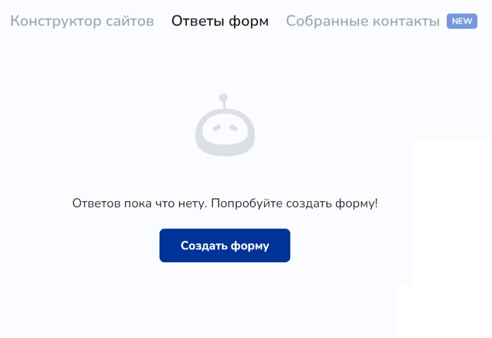<figcaption>
Рис. 1
</figcaption></figure>

Далее вы перейдете на страницу создания сайта с уже созданным шаблоном опроса.&#x20;

Здесь нам необходимо перейти в настройки и указать в полях название сайта, название в ссылке:

<figure>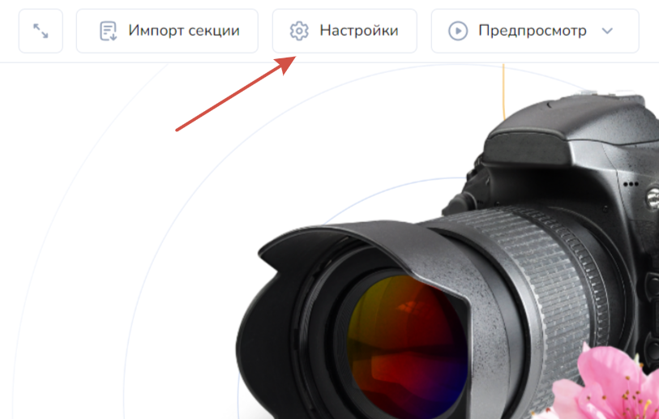<figcaption>
Рис. 2
</figcaption></figure> <figure>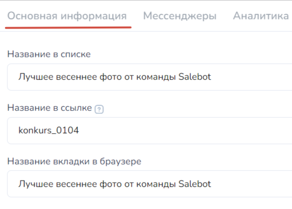<figcaption>
Рис. 3
</figcaption></figure>

Поле с названием в списке отобразится в списке уже созданных сайтов - так вам будет удобнее просматривать, прежде всего, просматривать получаемые данные с опроса во вкладке "Ответы форм".

Название в ссылке отобразит название сайта в адресной строке браузера:

<figure>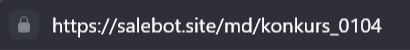<figcaption>
Рис. 4
</figcaption></figure>

Следующее поле покажет название во вкладке браузера:

<figure>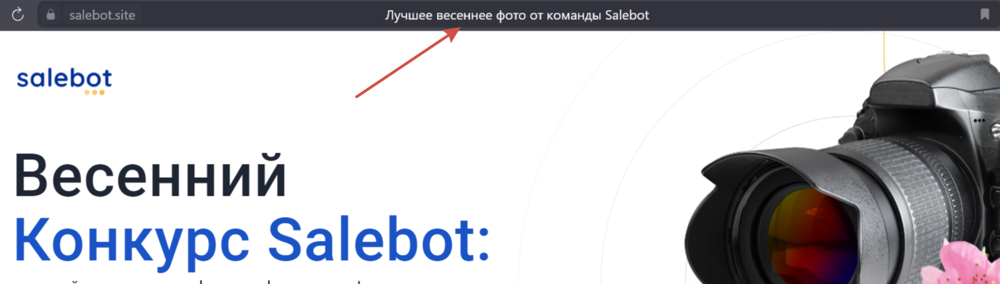<figcaption>
Рис. 5
</figcaption></figure>


Подробнее об иных настройках сайта читайте в статье "[Как создать сайт](/broken/pages/SVmo5FWy8HXy0n1EdOSO)".


### Блоки контента сайта

Непосредственно контент сайта, на основе которого будет вестись голосование, можно внедрить как отдельным блоком, например, "Текст", "Изображение" и др., так и в универсальном блоке.&#x20;

На данном этапе мы будем использовать именно универсальный блок по ряду причин:

1. В нем можно разместить любое количество фотографий (в вашем случае, это может видео или другие элементы, которые должны быть вынесены на голосование);
2. Помимо самих фотографий в универсальный блок можно вставить такие элементы, как текст, фигуру, аккордеон и т.д.

<figure>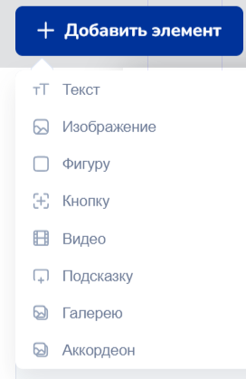<figcaption>
Рис. 6
</figcaption></figure>

3. Универсальный блок можно адаптировать под любое устройство: экран компьютера, планшета, смартфона.
4. Универсальный блок также можно обрабатывать по высоте, что позволит туда добавить достаточное количество контента.&#x20;


Подробнее о возможностях [универсального блока ](/broken/pages/xyl8etc4OH0St6lV8bto)читайте в одноименной статье.


Создаем универсальный блок:

<figure>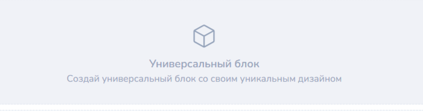<figcaption>
Рис. 7
</figcaption></figure>

После клика на блок, расположите нужные вам элементы в необходимом порядке. Для этого нажмите на "Добавить элемент" (см. рис 6).&#x20;

Например, добавим изображение:

<figure>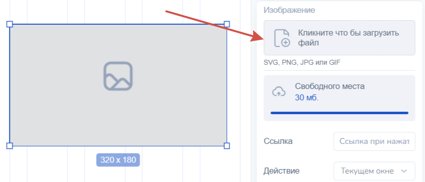<figcaption>
Рис. 8
</figcaption></figure> <figure>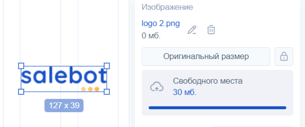<figcaption>
Рис. 9
</figcaption></figure>

И расположите элемент в необходимом месте универсального блока.&#x20;

Далее можно добавить необходимое количество элементов внутри универсального блока.&#x20;

Например, текст:

<figure>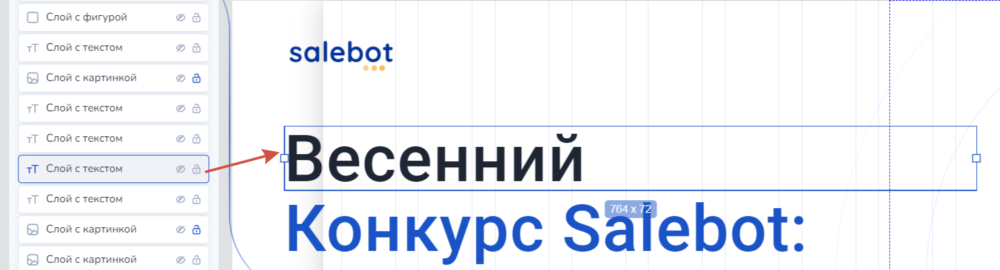<figcaption></figcaption></figure>

После того, как вы расположили элементы универсального блока в нужном вам порядке, перейдите к адаптации сайта под устройства:

<figure>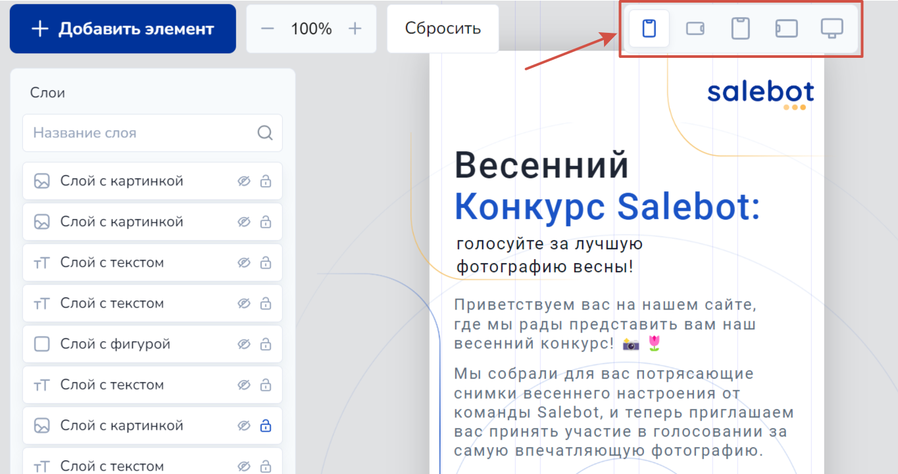<figcaption></figcaption></figure>

В данном случае все элементы, которые вы добавили в блок, присутствуют для каждого масштаба экрана. Удаление одного из них в любом масштабе приведет к удалению на основном экране.

Теперь первый универсальный блок на сайте готов. Обязательно нажмите сохранить, перед тем как закрыть вкладку.

Блок контента, где будут выставлены элементы для голосования, также создадим с помощью универсального блока: для этого добавьте еще один блок с помощью данной функции:

<figure>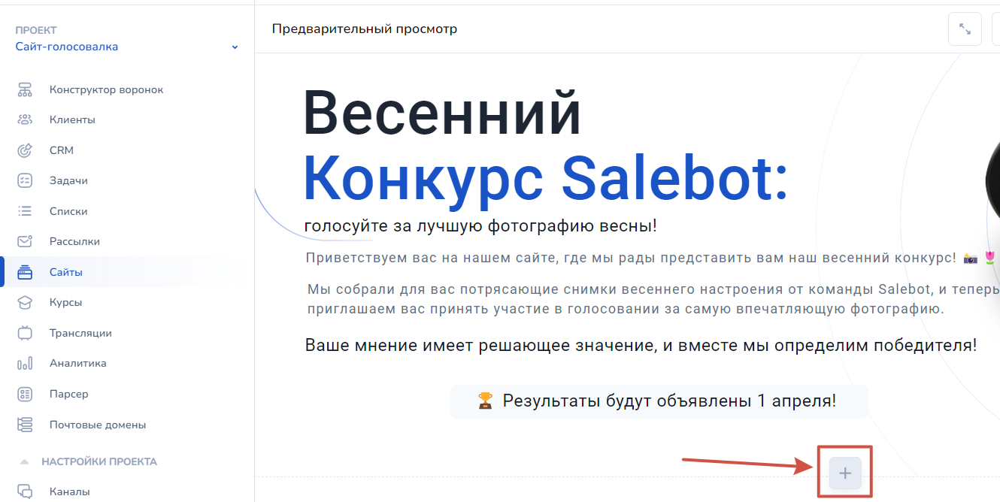<figcaption></figcaption></figure>

Для этого жмите на плюс и добавляйте необходимые блоки контента сайта: ограничений для добавления блока определенного вида нет - можно составить сайт, например, добавив несколько блоков одного типа.

После чего в настройках нового универсального блока расположим наши элементы для голосования:

<figure><figcaption></figcaption></figure>

Затем адаптируем наш универсальный блок под каждое устройство:

<figure>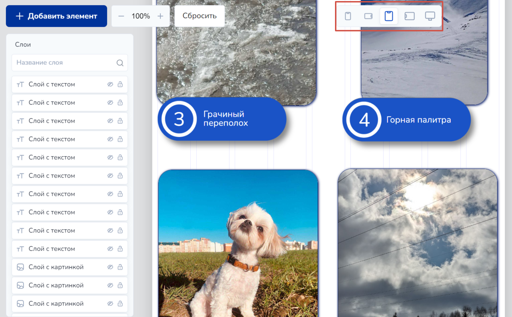<figcaption></figcaption></figure>

Теперь наш контент полностью готов. Давайте перейдем к созданию формы опроса.&#x20;

### Форма опроса

Поскольку мы изначально создали сайт с формой опроса, на сайте уже есть блок с формой опроса.&#x20;

Теперь нам остается заполнить форму с голосованием. Для этого перейдите в настройки блока формы опроса:

<figure>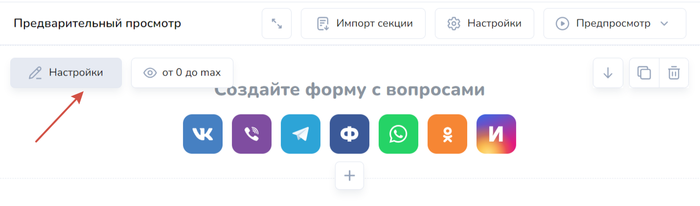<figcaption></figcaption></figure>

Далее создадим вопрос, в котором перечислим наименование фотографий, вынесенных на конкурс:

<figure>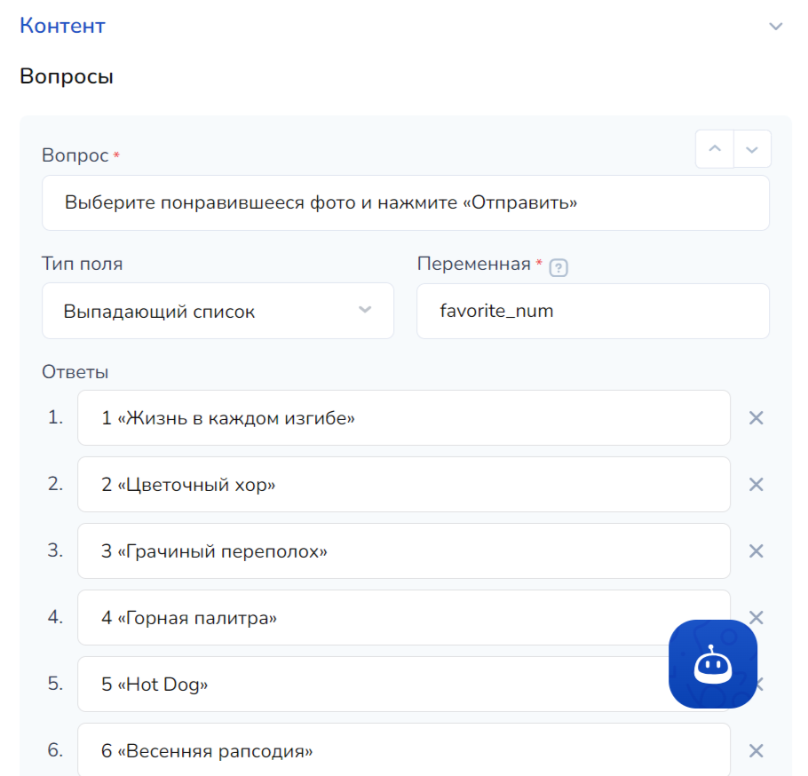<figcaption></figcaption></figure>

В поле переменной пропишите необходимое значение переменной, в противном случае вы не сможете заполнить вопросы.&#x20;

Далее выбираем чекбокс "Форма опроса":

<figure>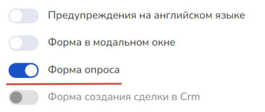<figcaption></figcaption></figure>

Теперь пропишем уведомление о том, что голосование было учтено:

<figure>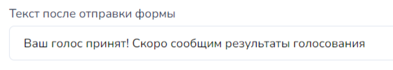<figcaption></figcaption></figure>

После того, как вы установили необходимые настройки, можно перейти к привязке телеграм-бота к вашему сайту для авторизации при отправке голоса.

## Авторизация на сайте перед отправкой формы

Чекбокс "Требовать авторизацию через Telegram":

<figure>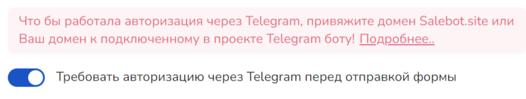<figcaption></figcaption></figure>

Для начала привяжем домен к подключенному в проекте Telegram-боту.&#x20;

Шаг 1. Перейдите в BotFather, в котором вы создавали своего телеграм-бота:

<figure><figcaption></figcaption></figure>

Шаг 2. Выберите телеграм-бота, которого Вам необходимо подключить к сайту, и кликните на него:

<figure><figcaption></figcaption></figure>

Шаг 3. Перейдите в настройки телеграм-бота:

<figure><figcaption></figcaption></figure>

Шаг 4. В настройках бота перейдите к домену:

<figure><figcaption></figcaption></figure>

Шаг 5. Кликните на "Установить домен"&#x20;

<figure><figcaption></figcaption></figure>


Если вы уже подключали домен к боту либо Вам понадобится установить новый домен к тому же боту, вместо кнопки "Set domain" будет - "Reset domain".&#x20;


Шаг 6. Отправьте боту домен, который хотите подключить к телеграм-боту: для этого в поле строки сообщения введите домен:&#x20;

<figure><figcaption></figcaption></figure>

Это может быть как ваш личный домен, который вы получали в регистраторе доменных имен, либо вида [https://sbsite.pro/](https://salebot.site/).&#x20;

На данном этапе привязка домена завершена.&#x20;

После привязки домена к боту, активируйте в настройках формы чекбокс "Требовать авторизацию через Telegram перед отправкой формы":

<figure>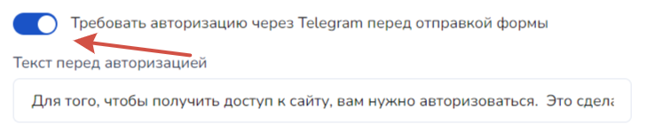<figcaption></figcaption></figure>

Готово! Теперь перед отправкой формы пользователю будет показано модальное окно с авторизацией через Telegram:

<figure><figcaption></figcaption></figure>

После того как пользователь авторизуется через Telegram и отдаст свой голос, в разделе клиенты от каждого зарегистрированного пользователя придет уведомление следующего вида:

<figure>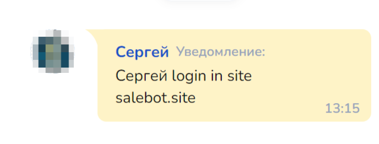<figcaption></figcaption></figure>

Далее можно настроить ответное сообщение через бот клиенту, используя указанное уведомление.&#x20;

Для этого перейдите в конструктор, где необходимо создать блок с условием (например, первостепенная проверка условия):

<figure>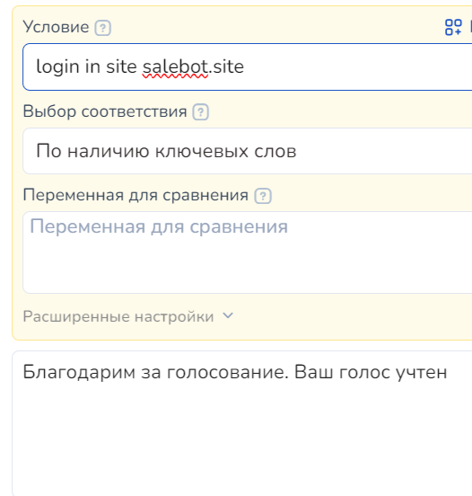<figcaption></figcaption></figure>

Далее укажите текст уведомления в условии, выберите тип соответствия "По наличию ключевых слов".

После чего пропишите сообщение.&#x20;

Готово! Вы успешно создали свой сайт с голосованием и привязали к нему Telegram-бота.&#x20;
