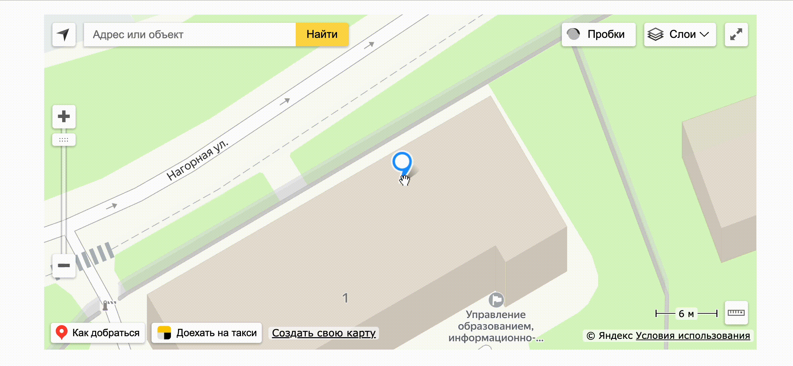

# Секция "Карты"

В конструкторе сайтов существует удобная и быстро настраиваемая секция "Карты:&#x20;

<figure><figcaption></figcaption></figure>

Секция карты решает сразу несколько вопросов, связанных с вашей компанией:

1. **Наглядно показывает местоположение организации:** клиенты смогут сразу увидеть, где находится компания, и проложить маршрут. Это особенно полезно для офлайн-бизнеса
2. **Создаёт доверие и подтверждает реальное существование компании:** карта с адресом помогает показать, что бизнес работает официально и обратиться к вам можно не только онлайн, но и офлайн.
3. **Дополняет контактные данные и делает их более наглядными:** вместо сухого текста с адресом и телефоном карта делает ваш сайт более наглядным и удобным.&#x20;

## Как создать блок "Карты"

Чтобы создать блок карты, перейдите на свой сайт в конструкторе:

<figure><figcaption></figcaption></figure>

Вы можете добавить блок как уже на существующий сайт, так и создать новый лендинг.&#x20;

В режиме редактирования сайта нажмите на "+", чтобы открылось меню с доступными секциями:

<figure><figcaption></figcaption></figure>

В меню с секциями (блоками) для сайта найдите секцию "Карта" и кликните по ней:

<figure><figcaption></figcaption></figure>

Секция "Карта" будет добавлена на ваш сайт:

<figure><figcaption></figcaption></figure>


Готово! Теперь вы знаете, как добавить секцию "Карта" на ваш сайт.&#x20;


## Настройки контента

После того, как секция "Карта" была добавлена на сайт, автоматически откроется меню настроек контента, где можно настроить:

1. Местоположение на карте;
2. Зум карты (масштаб);
3. Заголовок и текст маркера;
4. Заголовок и текст (в случае если выбрал стиль карты с текстовым блоком):

<figure><figcaption></figcaption></figure>

### Стили секции "Карта"

В стилях секции "Карта" можно выбрать вид карты с заголовком и текстом либо стандартный вид без заголовков и текстов.&#x20;

<figure><figcaption></figcaption></figure>

Стандартный вид карты в секции установлен по умолчанию и выглядит следующим образом:

<figure><figcaption></figcaption></figure>

Чтобы добавить в секцию текстовый блок, то необходимо выбрать один из двух видов:

1. Текстовый блок поверх карты:

<figure><figcaption></figcaption></figure>

Тогда текстовый блок будет расположен прямо на карте в секции:

<figure><figcaption></figcaption></figure>

2. Текстовый блок рядом с картой:

<figure><figcaption></figcaption></figure>

Тогда секция "Карта" на сайте будет выглядеть так:

<figure><figcaption></figcaption></figure>

Дополнительно к виду секции с текстовым блоком открываются поля для ввода заголовка и самого текста:

<figure><figcaption></figcaption></figure>


В стандартом виде секции "Карта" настроек для заголовок и текста нет.&#x20;


Для текстового блока поля с вводом текста и заголовка представляют стандартизированный набор, как для обычного текстового редактора:

<figure><figcaption></figcaption></figure>

Например, можно выбрать жирность шрифта, курсив, подчеркивание, цвет и выделение текста, выравнивание и т.д:

<figure><figcaption></figcaption></figure>

### Настройки карты

Шаг 1. Выберите зум карты:

<figure><figcaption></figcaption></figure>

Поле принимает значение от 1 до 20, где 20 - это наименьший масштаб карты (более детальные объекты), а 1 - наибольший масштаб (чем меньше масштаб карты, тем более детальной она будет отображаться).&#x20;

<figure><figcaption></figcaption></figure>

Шаг 2. Выберите координаты маркера:

<figure><figcaption></figcaption></figure>


Маркер на карте - это отмеченные на карте флажком координаты вашего адреса.&#x20;


<figure><figcaption>
Маркер - флажок на карте
</figcaption></figure>

Можно в строку координаты ввести ваши актуальные координаты:

<figure><figcaption></figcaption></figure>

Либо перенести маркер прямо на карте (тогда координаты автоматически изменятся):

<figure><figcaption></figcaption></figure>

Шаг 3. Пропишите при необходимости заголовок и текст маркера:

<figure><figcaption></figcaption></figure>

Заголовок и текст маркера отображаются при клике на флажок:

<figure><figcaption></figcaption></figure>

Для заголовка и текста маркера существуют стандартные настройки, как для любых текстовых редакторов:

<figure><figcaption></figcaption></figure>

Например, можно выбрать жирность шрифта, курсив, подчеркивание, цвет и выделение текста:

<figure><figcaption></figcaption></figure>

## Настройки отображений и фона

После того, как вы настроили контект секции, кликните "Сохранить":

<figure><figcaption></figcaption></figure>

Далее наведите на секцию курсором и найдите кнопку "Настройки":

<figure><figcaption></figcaption></figure>

Кликните по кнопке, тогда вам откроются настройки секции, в которой можно настроить фон и отображение секции на сайте:

<figure><figcaption></figcaption></figure>

Настройки фона и отображения являются универсальными настройками для каждой секции сайтов: то есть такие настройки стандарты для каждого блока:

<figure><figcaption></figcaption></figure>


Подробнее об универсальных настройках секции и отображения рассказали в статье "[Универсальные настройки секций: шрифты, фон и отображение](/broken/pages/oX6Y9RGmKT74x44vZ8gr)"

