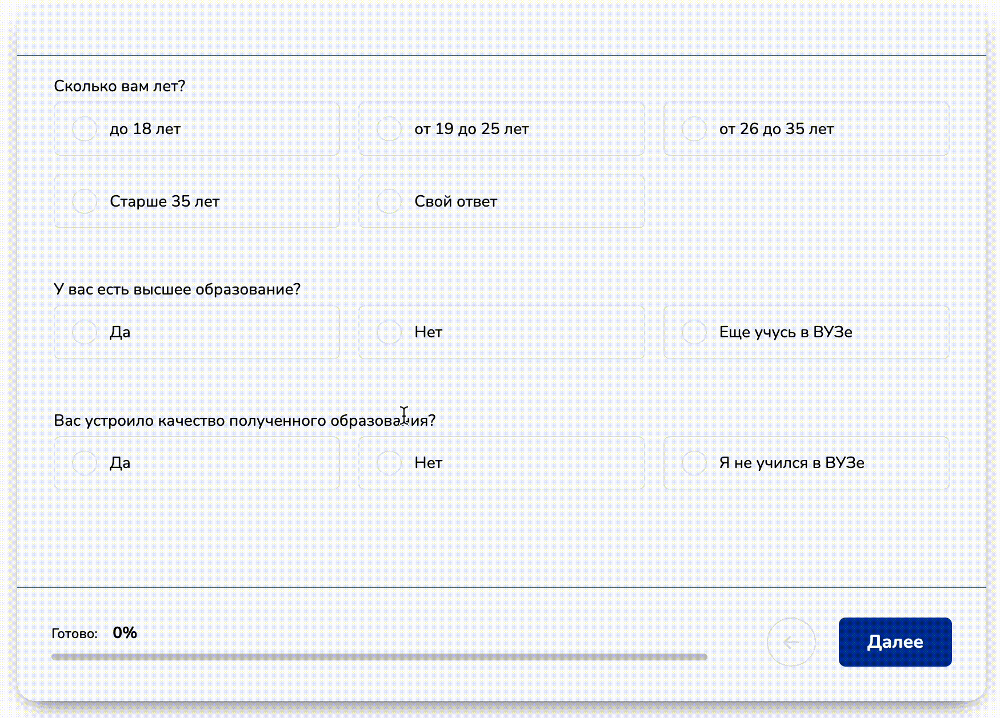

# Секция "Квиз"

Секция «Квизы» в конструкторе сайтов Salebot — это функциональный инструмент, который позволяет создавать интерактивные опросы и анкеты прямо на вашем сайте.&#x20;

<figure><figcaption></figcaption></figure>

Благодаря этому инструменту вы можете легко собирать мнения и данные от пользователей, делая процесс взаимодействия с клиентами более увлекательным и информативным. В статье мы подробно рассмотрим, как настроить секцию «Квизы», чтобы максимизировать её пользу для вашего бизнеса и улучшить качество обратной связи с аудиторией.

## Создание Квиз формы

Для создания форм вида "Постраничный опрос" вам необходимо:

а) создать новый сайт - если вы хотите создать "Постраничный опросы" на отдельном сайте;

б) добавить секцию "Квиз формы" - если вы хотите добавить секцию в уже готовый сайт.&#x20;

Для создания сайта с формой, необходимо перейти в раздел "Сайты":

<figure><figcaption></figcaption></figure>

Далее найдите кнопку "Создать" и кликнуть по кнопке "Создать сайт":

<figure><figcaption></figcaption></figure>

Выберите форму "Квиз": тогда будет создан лендинг с квиз-формой. Чтобы перейти в настройки страницы, нажмите "Редактировать":

<figure><figcaption></figcaption></figure>

На странице будет отображена готовая квиз-форма:

<figure><figcaption></figcaption></figure>

### Как добавить квиз на готовый сайт?

Чтобы добавить секцию (блок) квиз в уже готовый сайт перейдите в раздел "Сайты":

<figure><figcaption></figcaption></figure>

Далее найдите необходимый сайт и кликните по кнопке "Редактировать":

После чего вы перейдете на страницу редактирования вашего готового сайта.&#x20;

Далее найдите кнопку "+" между уже готовыми блоками (секциями) сайта, чтобы добавить новую секцию:

<figure><figcaption></figcaption></figure>

После клика на "+" откроется меню с секциями для сайтов, где необходимо найти блок "Квиз форма":

<figure><figcaption></figcaption></figure>

Кликните по секции "Квиз форма", чтобы она добавилась на вашу страницу сайта:

<figure><figcaption></figcaption></figure>


Теперь вы знаете, как добавить форму на ваш готовый сайт и создать сайт с заранее установленной формой!&#x20;


## Постраничный опрос

Постраничный опрос (или квиз) — это тип анкеты или теста, в котором вопросы разделены на несколько страниц. Пользователь отвечает на вопросы последовательно, переходя от одной страницы к следующей. Этот формат делает процесс взаимодействия более удобным и интуитивно понятным, так как вместо длинного списка вопросов пользователь видит их по одному или в небольших группах.

<figure><figcaption></figcaption></figure>

Преимущества постраничного опроса:

* **Упрощение восприятия**: Пользователь не перегружается длинным списком вопросов и может сосредоточиться на каждом вопросе отдельно.
* **Повышение вовлеченности**: Пошаговый формат часто вызывает больше интереса и удерживает внимание.
* **Сбор точных данных**: Благодаря структурированному подходу можно задавать более точные и конкретные вопросы, а также адаптировать следующие вопросы в зависимости от ответов пользователя.

Такие опросы идеально подходят для сбора обратной связи, проведения маркетинговых исследований и (или) генерации лидов.&#x20;

### Начало настройки

После того как вы создали сайт или добавили секцию с квизом на сайт, вам откроется меню настроек для данного блока:

<figure><figcaption></figcaption></figure>

Далее в поле "количество страниц" укажите необходимое количество страниц, где будут расположены ваши вопросы, не считая стартовую страницу и страницу результатов:

<figure><figcaption></figcaption></figure>

Теперь создайте первый вопрос - он автоматически будет расположен на первой странице:

<figure><figcaption>
Сначала необходимо кликнуть на "Создать вопрос"
</figcaption></figure> <figure><figcaption>
Первый вопрос - на первой странице
</figcaption></figure>

В контенте в меню настроек после создания вопроса вы найдете выпадающий список следующего вида:

<figure><figcaption></figcaption></figure>

Каждая страница квиза (постраничного опроса) содержит в себе собственный контент, который настраивается отдельно друг от друга.&#x20;

Например, на стартовой странице вы можете расположить изображения, на страницах опросов - сами вопросы, а также формы сбора данных, а в результатах - конечный итог опроса.&#x20;

### Страницы опросов

После того как вы создали первый вопрос, перейдите к его заполнению:

**Шаг 1. Пропишите сам вопрос:**

<figure><figcaption></figcaption></figure>

Далее выберите тип вопроса:

<figure><figcaption></figcaption></figure> <figure><figcaption></figcaption></figure>

Например, вы можете выбрать тип "Числовое поле", тогда ваш клиент при прохождении опроса сможет ввести только числовое значение.&#x20;

Можно выбрать и иные типы вопросов в зависимости от того, какие результаты вам необходимо получать и как их учитывать.&#x20;


Подробнее о типах поля, рассказали в основной статье "Ответы форм" в разделе "[Настройка контента: подраздел "Создать вопрос"](/broken/pages/YOzidl4HYJaWmkPXnuYY#nastroika-kontenta-podrazdel-sozdat-vopros).&#x20;


Если вы выбираете типы вопросов в виде "Имя", "Email", "Телефон" и др., то вводить текст вопроса и ответ на него в настройках контента уже не нужно - все заранее установлено разработчиками:

**Шаг 2. Добавьте ответы,** если выбрали типы вопросов, в которых клиенту необходимо выбрать вариант ответа:

<figure><figcaption></figcaption></figure>

В поле URL можно ввести ссылку на изображение: тогда картинка появится в поле с вопросом:

<figure><figcaption></figcaption></figure>

Для этого прогрузите необходимое изображение в файловое хранилище:

<figure><figcaption></figcaption></figure>

И после того как изображение загрузится, скопируйте ссылку на него:

<figure><figcaption></figcaption></figure>

Вставьте ссылку в поле для URL, и изображение появится в плашке необходимого вопроса:

<figure><figcaption></figcaption></figure>

Далее если вы заполните поле "Свободный ответ", то ваш пользователь сможет ввести ответ на свой вопрос в свободной форме:

<figure><figcaption></figcaption></figure>

В данном поле введите текстовое значение, например, "Свободный ответ" или "Свой ответ":

<figure><figcaption></figcaption></figure>

Тогда клиент сможет ввести ответ на вопрос в свободной форме:

<figure><figcaption></figcaption></figure>

**Шаг 3. Переменная**

Вы можете задать собственную переменнную для сбора данных в систему либо оставить установленное название для переменной:

<figure><figcaption></figcaption></figure>

Внутри переменной будет лежать то значение, которые выберет ваш клиент.&#x20;

**Шаг 4. Обязательный вопрос**

Если вам необходимо, чтобы клиент обязательно отвечал на созданный вами вопрос, то воспользуйтесь данным чекбоксом:

<figure><figcaption></figcaption></figure>

При активации чекбокса "Обязательный вопрос", клиент не сможет отправить форму, если не даст ответа на обязательный вопрос.&#x20;

Данный чекбокс можно поставить на любых типах вопроса: как при выборе варианта ответа, так при вводе клиентом номер телефона или email.&#x20;

**Шаг 5. Добавить следующие вопросы на странице**

Чтобы добавить любое необходимое количество вопросов на текущей странице, найдите кнопку "Добавить вопрос" под предыдущим вопросом:

<figure><figcaption></figcaption></figure>

Тогда вам откроется следующая плашка с настройками вопроса:

<figure><figcaption></figcaption></figure>

Настройки новых добавленных вопросов идентичны шагам 1-4.&#x20;

**Шаг 6. Настройка следующей страницы.**&#x20;

После того, как вы полностью настроили страницу 1, в зависимости от количества установленных страниц в настройке, вам необходимо перейти к настройке второй (а далее третьей, четвертой и т.д) страницы. Для этого пролистните вверх и найдите выпадающий список с выбором настройки страниц:

<figure><figcaption></figcaption></figure>

Выберите страницу, которую необходимо настроить, и нажмите на нее:

<figure><figcaption></figcaption></figure>

Здесь вы увидите кнопку "Добавить еще вопрос".&#x20;


Вопросы на последующих страницах настраиваются аналогично шагам 1-5.&#x20;


### Стартовая страница

Настройки стартовой страницы и страницы результата необязательны, поэтому если вы не хотите настраивать обложку для вашего квиза, то можно пропустить, и тогда ваш клиент сразу увидит вопросы с первой страницы.&#x20;

Если же вам по дизайну, например, вашего сайта необходимо настроить обложку, то найдите выпадающий список со страницами и кликните "Стартовая страница":

<figure><figcaption></figcaption></figure>

Выберите стартовая страница.&#x20;

Шаг 1. Создайте стартовую страницу:

<figure><figcaption></figcaption></figure>

Вам откроются настройки для загрузки изображения, заголовка и подзаголовка.&#x20;

Шаг 2. Пропишите Заголовок и Подзаголовок для стартовой страницы

Поля Заголовка и Подзаголовка не являются обязательными, но, например, для привлечения клиентов можно прописать уникальный офер:&#x20;

<figure><figcaption></figcaption></figure>

Настройки для текстовых элементов квизов аналогичны любому текстовому редактору: можно выбрать жирность, курсив, подчеркивание текста, размер шрифта, цвет, выравнивание и многое другое:

<figure><figcaption></figcaption></figure>

Шаг 3. Загрузите изображение.&#x20;

Для красочности секции и стартовой страницы добавьте изображение:

<figure><figcaption></figcaption></figure>


Готово!&#x20;

Вы смогли настроить стартовую страницу постраничного опроса.&#x20;


## Как добавить кнопки на мессенджеры в секцию квиз?

Предварительно советуем перейти в редактирование контента:

<figure><figcaption></figcaption></figure>

И добавить чекбоксы в форму для согласия с обработкой данных:

<figure><figcaption></figcaption></figure>

Наведите на секцию, чтобы найти кнопку "Настройки".&#x20;

<figure><figcaption></figcaption></figure>

Кликните по кнопке, тогда откроется меню настроек справа:

<figure><figcaption></figcaption></figure>

Теперь разверните выпадающее меню "Настройки кнопок":

<figure><figcaption></figcaption></figure>

И кликните на кнопку "Мессенджеры":

<figure><figcaption></figcaption></figure>

Вам откроется список мессенджеров, кнопки которых можно добавить в квиз-форму. Проставьте чекбоксы тех кнопок, которые хотите отобразить на странице:

<figure><figcaption></figcaption></figure>


Внимание!&#x20;

Отобразятся только те кнопки мессенджеров, которые подключены в разделе "Каналы".


Далее можно настроить кнопку по своему усмотрению, кликнув на "Настроить" в строке:

<figure><figcaption></figcaption></figure>

Например, можно кастомизировать кнопку под цветовое решение своего сайта, прописать текст и пр.:

<figure><figcaption></figcaption></figure>
