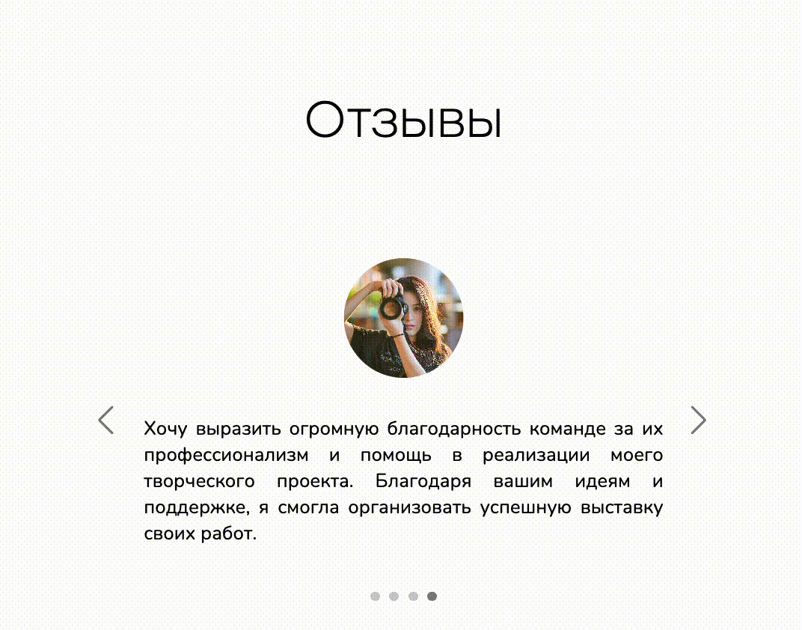

# Секция "Настраиваемые карточки"

Секция "Настраиваемые карточки" в конструкторе сайтов создана для тех, кто хочет легко и быстро представить ключевую информацию о своих продуктах, услугах или отзывах клиентов.  Данные блоки позволяют добавить на страницу сайта визуально привлекательные карточки, которые можно настроить под нужды вашего бизнеса.&#x20;

<figure><figcaption></figcaption></figure>

Независимо от того, хотите ли вы представить подробное описание курса, отзывы довольных клиентов или рекомендации по использованию ваших услуг, "Настраиваемые карточки" и "Карточки курсов" помогут выделить информацию и сделать её более доступной и удобной для посетителей сайта.

## Как добавить блок?

Чтобы добавить секцию "Настраиваемые карточки", нажмите на "+" в режиме редактирования вашего сайта:

<figure><figcaption></figcaption></figure>

Далее найдите в открывшемся меню секцию "Настраиваемые карточки" и кликните на него, чтобы секция добавилась на сайт. Секция будет добавлена на сайт, а для вас откроется меню настроек контента:

<figure><figcaption></figcaption></figure>

## Как добавить карточку?&#x20;

В меню редактировании секции "Настраиваемые карточки" контента вы увидите различные разделы для настроек: и стиля карточек, и изображений, кнопок и пр.&#x20;

Для вашего удобства можно сначала добавить карточки, чтобы увидеть, как настройки стиля применяются к карточкам.&#x20;

Для этого пролистните вниз в меню настроек контента и найдите кнопку "Добавить карточку":

<figure><figcaption></figcaption></figure>

Кликнув по кнопке "Добавить карточку", вы увидите настройки для карточки с пустым полем для текста, плашкой для загрузки изображения для карточки и для иконки кнопки, а также для текста самой кнопки:

<figure><figcaption></figcaption></figure>

Поля настроек карточки не являются обязательными: то есть вы можете пропустить, например, загрузку изображения для самой карточки или для иконки кнопки, не вставлять текст - все по вашему усмотрению.&#x20;

Если, например, вам не нужна кнопка с ссылкой в карточке, оставьте поля "Название кнопки" и "Ссылка" пустыми: тогда кнопки не будут отображены в карточке.&#x20;

<figure><figcaption></figcaption></figure>

Для текста карточки существуют различные настройки, аналогично любому текстовому редактору, где вы можете настроить размер шрифта, его начертание, цвет, выделение, а также добавить ссылку и прочее.&#x20;

Для этого выделите текст (часть текста) и примените необходимые настройки к тексту:

<figure><figcaption></figcaption></figure>

После того, как вы полностью настроили первую карточку, добавьте следующую: для этого нажмите на кнопку "Добавить карточку", которая расположена ниже плашки настроек первой добавленной карточки:

<figure><figcaption></figcaption></figure>

## Настройка карточек


Карточки настраиваются в едином стиле: все настройки, которые вы используете в данном разделе, будут применены ко всем карточкам одной секции.&#x20;


### Стиль карточек

В конструкторе сайтов Сейлбот существует два стиля для карточек: простой и в виде слайдера.&#x20;

При применении простого стиля, все карточки будут сразу отображены на одной странице секции сайта:

<figure><figcaption></figcaption></figure>

При применении стиля "Слайдер" карточки будут в виде карусели, тем самым вы добавите  больше динамичности сайту:&#x20;

<figure><figcaption></figcaption></figure>

Для стиля слайдер можно выбрать, где будут расположены стрелки и точки карточки:

<figure><figcaption></figcaption></figure>

Стрелки могут быть расположены внутри слайдера, снаружи или скрыты (например, если вы выставите таймер для автоматического перелистывания карточек):

<figure><figcaption></figcaption></figure> <figure><figcaption></figcaption></figure>

Точки так же могут быть расположены внутри слайдера, снаружи или скрыты:

<figure><figcaption></figcaption></figure> <figure><figcaption></figcaption></figure>

Чтобы карточки перелистывались автоматически, задайте временной интервал показа одной страницы:

<figure><figcaption></figcaption></figure>

Если значения таймера установлено 0, то автоматически карточки перелистываться не будут.&#x20;


Обращаем внимание!&#x20;

Время задается в миллисекундах, где одна миллисекунда равна 0.001 секунды. Это значит, если вам необходимо задать 7 секунд, то вводите значение в поле 7000.&#x20;


Также можно выбрать вид карточки:&#x20;

<figure><figcaption></figcaption></figure>

а) стандартный вид без заголовка внутри карточки:

<figure><figcaption></figcaption></figure>

б) вид с заголовком внутри карточки:&#x20;

<figure><figcaption></figcaption></figure>

### Настройки цвета для элементов карточки

Чтобы кастомизировать карточки под свой стиль, воспользуйтесь настройками цвета:

<figure><figcaption></figcaption></figure>

Настройки цвета применяются ко всем карточкам одновременно. Если вам необходимо, чтобы цвет текста был разным в каждой карточке, то воспользуйтесь настройками в текстовом поле.&#x20;

Для настройки цвета доступна обширная цветовая палитра:

<figure><figcaption></figcaption></figure>

А применить настройки цвета можно к любому элементу карточки:

<figure><figcaption></figcaption></figure>

### Настройка границ и отступов

<figure><figcaption></figcaption></figure>

1. **Количество карточек в строке** - текстовое поле, которое поможет установить необходимое количество карточек в одну строку (страницу):

<figure><figcaption>
Заданное количество карточек
</figcaption></figure>

<figure><figcaption>
Стиль "Простые карточки"
</figcaption></figure> <figure><figcaption>
Стиль "Слайдер" 
</figcaption></figure>

2. **Отступы  -** поля для ввода числовых значений, которые помогут увеличить или уменьшить горизонтальные/вертикальные отступы между карточек,  а также отступы внутри карточек,&#x20;

<figure><figcaption></figcaption></figure>

Для отступа внутри карточек можно установить общее числовое значение либо, кликнув на шестеренку в правом углу строки, установить для верхней, нижней, левой и правой границы отдельное значение:

<figure><figcaption></figcaption></figure>

#### Ориентация карточки

<figure><figcaption></figcaption></figure>

Ориентация карточки может быть горизонтальной:

<figure><figcaption></figcaption></figure>

А также вертикальной:

<figure><figcaption></figcaption></figure>

#### **Выравнивание**

<figure><figcaption></figcaption></figure>

а) по центру:

<figure><figcaption></figcaption></figure>

б) по левому краю:

<figure><figcaption></figcaption></figure>

в) по правому краю:

<figure><figcaption></figcaption></figure>

#### **Настройки тени**

Поможет придать карточкам глубины и выделить их на фоне секции/страницы.&#x20;

<figure><figcaption></figcaption></figure>

а) без тени:

<figure><figcaption></figcaption></figure>

б) легкая тень:

<figure><figcaption></figcaption></figure>

в) сильная тень:

<figure><figcaption></figcaption></figure>

## Настройка изображений

Настройка изображений также применяется относительно всех изображений, которые вы добавили в карточку:&#x20;

<figure><figcaption></figcaption></figure>

В настройках изображения необходимо задать:

а) ширину изображения:

<figure><figcaption></figcaption></figure>

Поле принимает числовое значение в пикселях, если не задано, то отображается автоматически соразмерно настоящей ширине изображения в пикселях.&#x20;

б) высота изображения:

<figure><figcaption></figcaption></figure>

Поле принимает числовое значение в пикселях, если не задано, то отображается автоматически соразмерно настоящей высоте изображения.

в) скругление:

<figure><figcaption></figcaption></figure>

Поле, принимающее числовое значение в пикселях, - помогает скруглить углы изображения:

<figure><figcaption></figcaption></figure>

г) размер изображения:

<figure><figcaption></figcaption></figure>

Настройка применяется, если необходимо заполнить/растянуть/поместить изображение относительно заданных ширины и высоты для изображения.&#x20;

д) чекбокс "Картинка после текста"&#x20;

<figure><figcaption></figcaption></figure>

Если поставить галочку, то изображение будет расположено под текстом в карточке:

<figure><figcaption></figcaption></figure>

## Настройка кнопок

<figure><figcaption></figcaption></figure>

**Текст**, а также **ссылка** на страницу, по клику на которую должен перейти ваш посетитель сайта, настраивается в самой карточке:

<figure><figcaption></figcaption></figure>

Также помимо текста и ссылки вы можете установить иконку для кнопки, загрузив изображение в карточке:

<figure><figcaption></figcaption></figure>

Чтобы установить цвет текста и фона кнопки, воспользуйтесь настройками здесь:

<figure><figcaption></figcaption></figure>

Далее можно настроить размер, ширину, отступы для кнопки:

<figure><figcaption></figcaption></figure>

1. **Ширина кнопки** - поле, принимающее числовое значение как в пикселях, так и процентах:

<figure><figcaption></figcaption></figure>

2. **Выравнивание кнопки** - поможет установить кнопку в карточке относительно правого или левого края, а также центра:

<figure><figcaption></figcaption></figure>

а) по центру:

<figure><figcaption></figcaption></figure>

б) по левому краю:

<figure><figcaption></figcaption></figure>

в) по правому краю:

<figure><figcaption></figcaption></figure>

3. **Скруление кнопки -** поле, принимающее числовое значение в пикселях, для скругления углов кнопки:

<figure><figcaption></figcaption></figure>

4. **Ширина обводки -** поле, принимающее числовое значение в пикселях, для установки ширины обводки кнопки:

<figure><figcaption></figcaption></figure>

5. **Отступы снаружи**&#x20;

Поможет настроить отступы для кнопки в карточке относительно верхнего, нижнего, левого и правого края:&#x20;

<figure><figcaption></figcaption></figure>

6. **Отступы внутри кнопки**

Поможет настроить отступы внутри кнопки:

<figure><figcaption></figcaption></figure>

7. **Иконка**

Если вы загрузили иконку в кнопку в карточке, то к иконку можно настроить по размеру:

<figure><figcaption></figcaption></figure>

А также установить расположение иконки относительно текста слева или справа:

<figure><figcaption></figcaption></figure>

8. **Тень для кнопки**

Тень можно установить не только для карточки, но и отдельно для кнопки. Для этого достаточно в настройках кнопки найти выпадающее поле с названием "Тень" и выбрать степень интенсивности тени: легкую или сильную:

<figure><figcaption></figcaption></figure>

9. **Анимация кнопки**

<figure><figcaption></figcaption></figure>

Поможет привлечь внимание клиентов (пользователей сайта) к целевому действию по кнопке и добавит динамики сайту:

1\) flash анимация кнопки:

<figure><figcaption></figcaption></figure>

2\) ripper анимация кнопки:

<figure><figcaption></figcaption></figure>


Готово! \
Теперь вы знаете, как создавать и настраивать карточки на своем сайте с нуля.&#x20;

