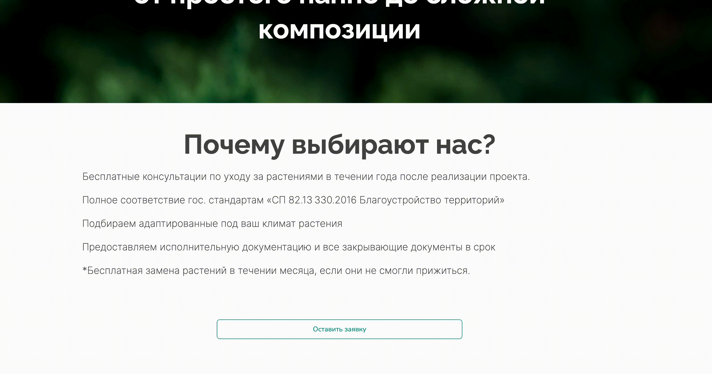
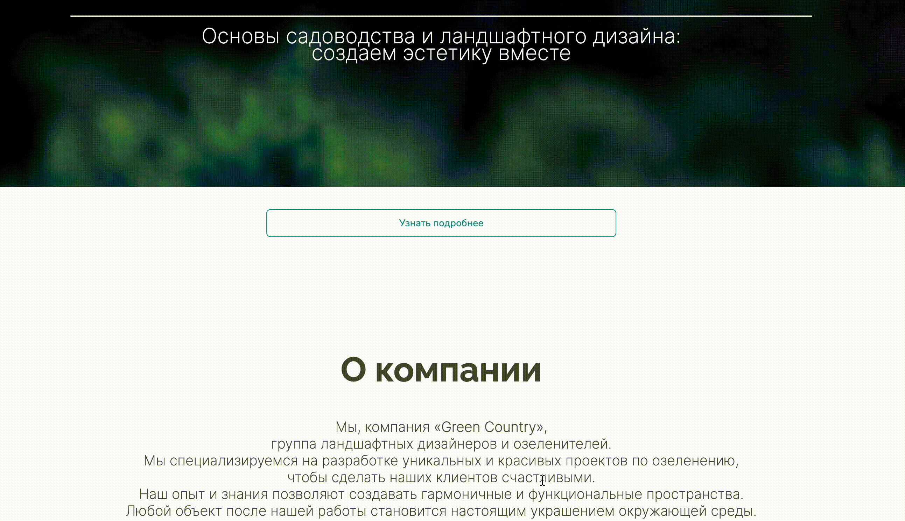

# Секция "Pop-up"

Pop-up - это всплывающее окошко, которое появляется на сайте после выполнения целевого действия на лендинге. Внутри окна может лежать форма сбора данных, текстовый блок, галерея и любые другие секции, существующие в конструкторе Salebot:

<figure><figcaption></figcaption></figure>

Целевым действием для pop-up в конструкторе сайтов Salebot является нажатие на кнопку, в которой лежит значение секции.

Как настроить секцию и открытие окошка по кнопке, читайте далее.

## Настройка Pop-up

Чтобы создать секцию pop-up, необходимо кликнуть на "+" для открытия меню с секциями:

<figure><figcaption></figcaption></figure>

Далее в открывшемся меню найдите секцию Pop-up:

<figure><figcaption></figcaption></figure>

И далее кликните на поп-ап, чтобы секция добавилась на ваш сайт:

<figure><figcaption></figcaption></figure>

В pop-up можно добавить любое количество секций, сделав, например, информационное окошко на лендинге.&#x20;

Чтобы добавить в поп-ап секцию, кликните по кнопке "Заполнить поп-ап":

<figure><figcaption></figcaption></figure>

Откроется модальное окно с секциями, которые можно вложить внутрь pop-up:

<figure><figcaption></figcaption></figure>

Для примера добавим несколько секций сайта внутрь поп-апа:&#x20;

<figure><figcaption></figcaption></figure>

Внутри pop-up можно сделать второй минилендинг, поскольку в окне может находится неограниченное количество секций.&#x20;

<figure><figcaption></figcaption></figure>

Секции внутри pop-up настраиваются так же, как и секции, из которых вы будете конструировать свой сайт.&#x20;

## Настройка кнопки

Pop-up будет открываться на вашем сайте при нажатии на кнопку. При этом можно использовать в качестве открытия кнопки как секцию "Меню", так и секцию "Кнопки":

<figure><figcaption></figcaption></figure>

### Как добавить pop-up в секцию "Меню"

Чтобы добавить поп-ап в блок "Меню", скопируйте значение секции всплывающего окна:

<figure><figcaption></figcaption></figure>

Далее перейдите к настройкам секции "Меню":

Шаг 1. Добавьте секцию меню:

<figure><figcaption></figcaption></figure>

Шаг 2. Добавьте кнопку в настройках контента секции "Меню":

<figure><figcaption></figcaption></figure>

Шаг 3. Выберите действие для кнопки "В текущем окне":

<figure><figcaption></figcaption></figure>

Шаг 4. Добавьте в поле ссылки значение ID pop-up:

<figure><figcaption>
ID pop-up в поле "ссылка" в настройках кнопки
</figcaption></figure> <figure><figcaption>
где найти значение pop-up
</figcaption></figure>

Шаг 5. Сохраните настройки сайта:

<figure><figcaption></figcaption></figure>

Шаг 6. Тестирование

Чтобы просмотреть, как pop-up открывается в меню сайта, перейдите на страницу сайта:

<figure><figcaption></figcaption></figure>

Далее кликните по своей созданной кнопке в меню:

<figure><figcaption></figcaption></figure>

Как видно, pop-up открывается только при клике на кнопку, в которой вы можете прописать целевое действие для клиента: например, записаться на прием, читать подробнее и т.д.&#x20;

### Как добавить pop-up в секцию "Кнопки"

Чтобы добавить поп-ап в блок "Меню", скопируйте значение секции всплывающего окна:

<figure><figcaption></figcaption></figure>

Далее перейдите к настройкам секции "Кнопки":

Шаг 1. Добавьте блок "Кнопки" на сайт:

<figure><figcaption></figcaption></figure>

Шаг 2. Добавьте кнопку в настройках контента блока:

<figure><figcaption></figcaption></figure>

Шаг 3. Установите функцию кнопки - ссылка:

<figure><figcaption></figcaption></figure>

Шаг 4. Укажите значение из секции pop-up в ссылку кнопки:

<figure><figcaption></figcaption></figure> <figure><figcaption></figcaption></figure>

Шаг 5. Нажмите "Сохранить", чтобы добавить кнопку:

<figure><figcaption></figcaption></figure>

Шаг 6. Тестирование

Сохраните настройки сайта:

<figure><figcaption></figcaption></figure>

Чтобы просмотреть, как pop-up открывается в меню сайта, перейдите на страницу сайта:

<figure><figcaption></figcaption></figure>

Далее кликните по своей созданной кнопке с функцией открытия pop-up:

<figure><figcaption></figcaption></figure>


Всплывающее окошко поможет разгрузить ваш сайт, сделать его более подвижным и гибким, а также добавить дополнительную информацию, не нарушая основную логику и дизайн сайта.

