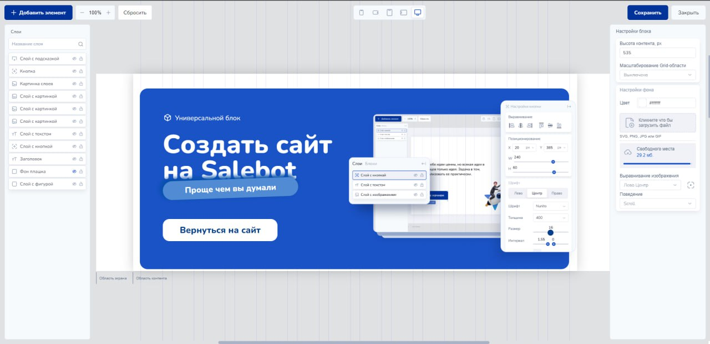
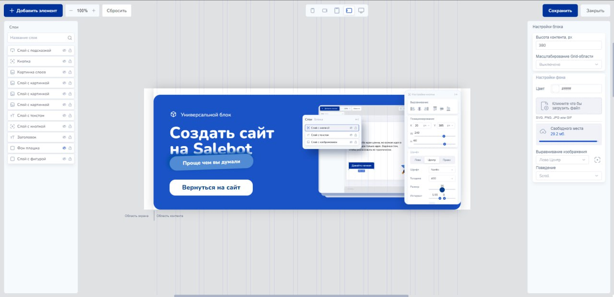
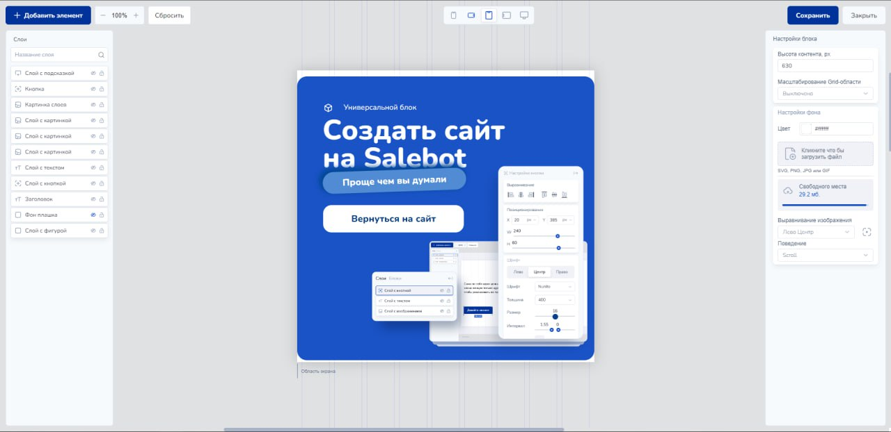
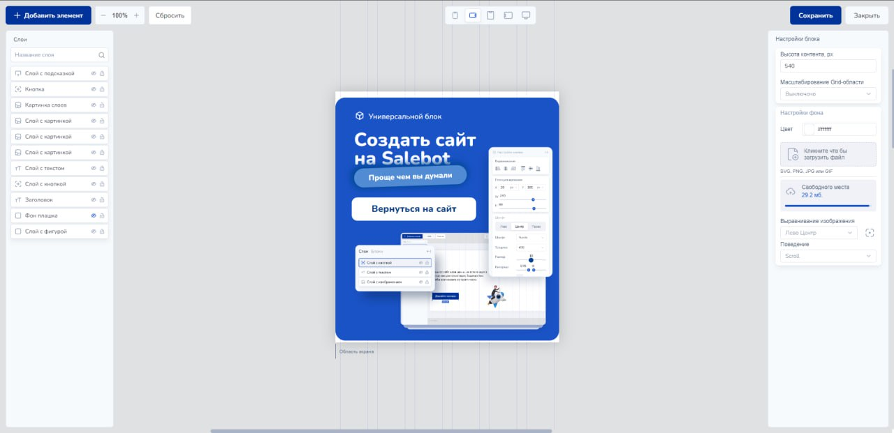
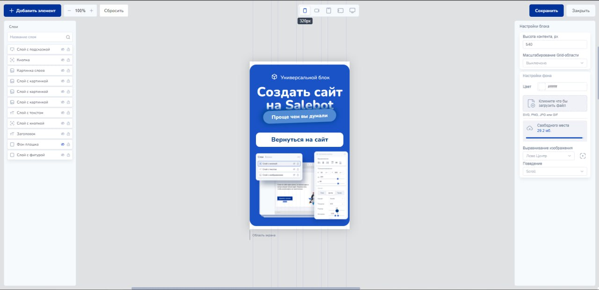

# Как адаптировать страницу в универсальном блоке

Если созданная страница в универсальном блоке хорошо выглядит на компьютере, но на экране мобильного телефона или планшета сайт будет отображаться не правильно так как размер этих устройств разный.

### Основная информация

В универсальном блоке необходимо настроить адаптацию для планшета и телефона в горизонтальном и вертикальном положении.

* Для компьютера размер блока составляет 1200px
* Планшет в горизонтальном положении 960px
* Планшет в вертикальном положении 640px
* Телефон в горизонтальном положении 480px
* Телефон в вертикальном положении 320px

Для это в блоке есть данный инструмент, который при переключении автоматически показывает нужный размер страницы в которой должны поместится все созданные элементы сайта: текст, фигуры, кнопки, видео и прочее

<figure><figcaption></figcaption></figure>

Изначально мы создаем дизайн для большой версии экрана (компьютер) 

<figure><figcaption></figcaption></figure>

После начинаем адаптировать созданную страницу, сначала для планшета в горизонтальном положении и так далее. Чтобы это сделать используем панель инструментов в блоке, подгоняя размеры текстов и элементов так, чтобы они не выходили за приделы блока, иначе их не будет видно на устройствах пользователей сайта. \
\
Приведем примеры того, как должна выглядеть страница для каждого размера устройствах:\
\
Планшет в горизонтальном положении 960px 

<figure><figcaption></figcaption></figure>

Планшет в вертикальном положении 640px

<figure><figcaption></figcaption></figure>

Телефон в горизонтальном положении 480px

<figure><figcaption></figcaption></figure>

Телефон в вертикальном положении 320px

<figure><figcaption></figcaption></figure>

Все базовые блоки в конструкторе сайтов автоматически адаптируются под нужный размер экран. Какие существуют базовые блоки читайте в следующих статьях.

### Видео-инструкция


