# Виджет обратной связи

Виджет обратной связи устанавливается на сайте для того, чтобы посетители могли легко связаться с компанией и задать интересующие их вопросы. Это помогает улучшить взаимодействие с клиентами и оперативно консультировать их, а также собирать отзывы и предложения для повышения уровня удовлетворённости пользователей.


При заполнении клиентов формы в виджете обратной связи, клиент создается в разделе "Клиенты", куда также попадает информация о нем.


## Настройки


Обращаем внимание! \
Перед настройкой виджета обратной связи убедитесь, что у вас подключена одна из интеграций телефонии. В противном случае, виджет не может быть установлен на сайт.



Как подключить телефонию в Salebot, читайте в разделе "[Интеграции](/broken/pages/-M1dsRhrcgfbT0sgiazE)" - "[Телефония](/broken/pages/7WfU841wEEF0kV9gOoXy)".


### Основная информация

<figure>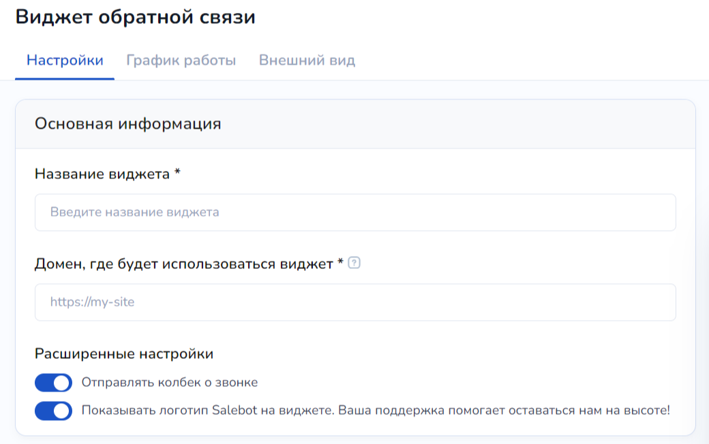<figcaption></figcaption></figure>

В разделе "Основная информация" настроек существуют пустые поля с наименованием самого виджета, а также сайта, куда он должен быть внедрен.&#x20;

1. **Название**\
   Соответственно в данном поле вы можете прописать любое необходимое наименование виджета, которое будет отображено на сайте. Это поле является обязательным.
2. **Домен, где будет использован виджет.** \
   Это второе обязательное поле, где необходимо указать домен сайта. Это может быть как сайт, спроектированный на Salebot, так и на сервисе Тильда, а также на свой собственный.

В расширенных настройках  основной информации можно активировать чекбокс для отправки колбеков о звонке:

<figure>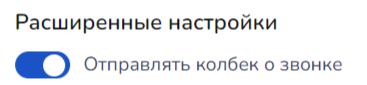<figcaption></figcaption></figure>

Колбеки виджета обратной связи не совпадают с колбеками подключенной телефонии и имеют вид:

<figure>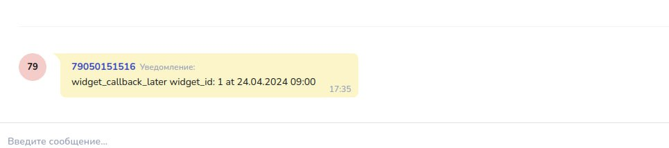<figcaption></figcaption></figure>

В последующем вы можете настроить реакцию чат-бота на полученные колбеки.


Какие колбеки существуют, читайте ниже в разделе "[Колбеки](vidzhet-obratnoi-svyazi.md#kollbeki)"


Также по своему усмотрению, можно оставить или скрыть логотип "Сделано Salebot" с помощью данного чекбокса:

<figure>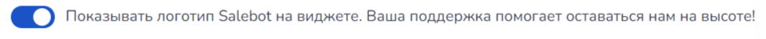<figcaption></figcaption></figure>

### Условия срабатывания

<figure><figcaption></figcaption></figure>

#### Временной интервал

Можно установить тайминг показа виджета на сайте. Для этого воспользуйтесь функцией "Когда показывать виджет":

1. **Сразу**\
   Данная настройка отобразит виджет в момент перехода пользователя на сайт.&#x20;
2. **Спустя время**

<figure><figcaption></figcaption></figure>

Виджет отобразится на сайте по прошествию определенного количества секунд после того, как клиент перешел на сайт.

Устанавливается временной интервал в секундах, где минимальное значение - 1 секунда, а максимальное  - 15 секунд.

3. **После прокрутки**

<figure>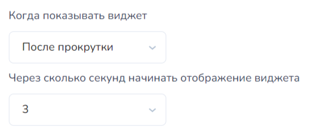<figcaption></figcaption></figure>

Условие "После прокрутки" обозначает, что как только пользователь совершит действие по прокрутке сайта, независимо от того, полностью ли он долистал сайт до конца или просмотрел небольшую часть, виджет отобразится на сайте по прошествии установленного количества секунд.&#x20;

Минимальное значение временного интервала - 1 секунда; максимальное  - 15.&#x20;

### Факторы отображения на сайте

<figure>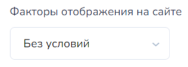<figcaption></figcaption></figure>

Можно установить отображение виджета как без условий, так и по условиям. Разберем подробнее существующие условия.

1. UTM-метки


Чтобы узнать, что такое UTM-метки и как ими пользоваться, рекомендуем прочитать статью "[Как передать параметры и UTM-метки](https://docs.salebot.pro/minilendingi-v-socialnykh-setyakh/kak-peredat-parametry-i-utm-metki)".


<figure><figcaption></figcaption></figure>

В соответствующем поле пропишите название необходимой метки:

<figure><figcaption></figcaption></figure>

Далее выберите оператор соответствия метки значению:

<figure><figcaption></figcaption></figure>


В чем разница содержит/не содержит и равно/не равно?

Основное различие в том, что "**содержит/не содержит**" проверяет значение на факт того, что UTM-метка включает (или не включает) то или иное значение. \
Тогда как оператор "**равно**" строго присваивает значение, в связи с чем система ищет совпадение в UTM-метке по строгому значению (соответственно "Не равно" противоположно).


После чего пропишите необходимое значение для UTM-метки:

<figure><figcaption></figcaption></figure>

2. Страна

<figure><figcaption></figcaption></figure>

Также можно выбрать условие "Страна", которое отобразит виджет в зависимости от IP страны подключения. \
Выберите необходимую страну из перечня, а также тип оператора (является или не является):

<figure><figcaption></figcaption></figure>

3. Устройство

<figure><figcaption></figcaption></figure>

При необходимости установите условие "Устройство", которое отобразит виджет в зависимости от типа устройства клиента, перешедшего на сайт:

<figure><figcaption></figcaption></figure> <figure><figcaption></figcaption></figure>

В настройках также существует функция для добавления нескольких значений для отображения виджета. Для этого достаточно кликнуть по "+ Добавить значение" и установить еще одно или несколько необходимых условий:

<figure><figcaption></figcaption></figure>

### Телефония

По своему усмотрению вы можете подключить телефонию для срабатывания обратного звонка либо собирать заявки для дальнейшей связи с клиентом без автоматического звонка.&#x20;

<figure><figcaption></figcaption></figure>

Чекбокс "Обратный звонок через телефонию" в активном состоянии поможет автоматически принимать заявки для обратного вызова клиенту спустя время, установленное в настройках виджета.&#x20;

При неактивном состоянии данного чекбокса, будет создаваться заявка на звонок с данными клиента, где вы сможете уже связаться с ними вне подключенных интеграций с телефонией. Однако помните, что функционал таймера и отложенного звонка в виджете не будет доступен.&#x20;

Чтобы виджет с активным чекбоксом телефонии работал корректно, подключите [телефонию](/broken/pages/7WfU841wEEF0kV9gOoXy).&#x20;

<figure>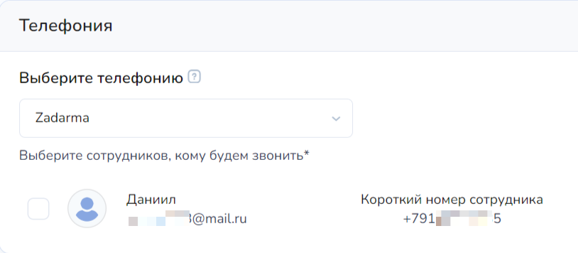<figcaption></figcaption></figure>

Если у вас уже установлена телефония, то выберите соответствующую интеграцию в списке:

<figure>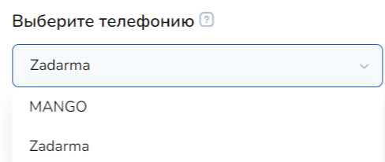<figcaption></figcaption></figure>

После того, как была выбрана телефония, вы сможете выбрать доступных для звонков сотрудников в проекте, поставив галочку напротив:

<figure>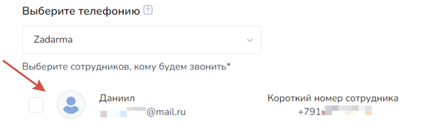<figcaption></figcaption></figure>


Если клиента нет в проекте, с номером звонящего создается клиент типа Whatsapp


## График работы

<figure>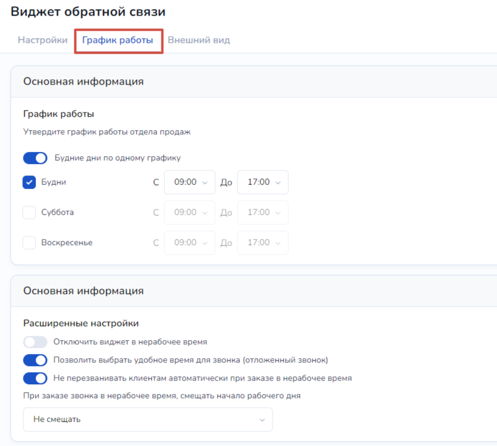<figcaption></figcaption></figure>

График работы играет ключевую роль для чекбоксов "**Отключить виджет в нерабочее время**" и "**Не перезванивать клиентам автоматически при заказе в нерабочее время**":

<figure>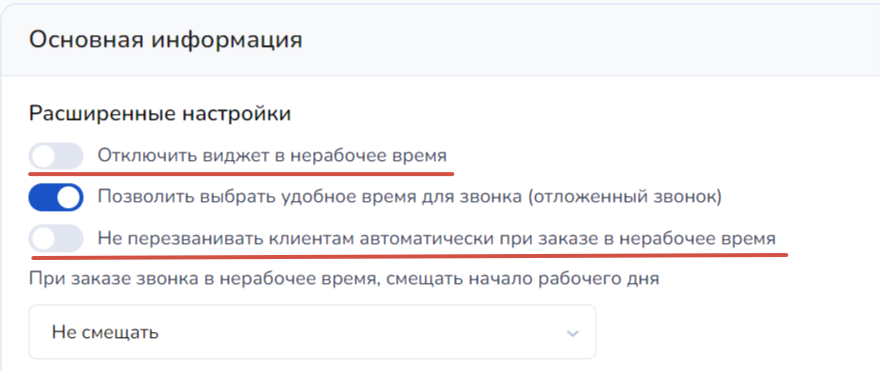<figcaption></figcaption></figure>

Соответственно при активированных чекбоксах "Отключить виджет" и "Не перезванивать автоматически", согласно графику, виджет не будет активен и (или) функция авто-перезвона не будет работать вне рабочего времени ваших сотрудников.\
Что является очень удобным, поскольку тогда ваши клиенты не будут теряться в догадках, почему они заказали звонок, а его не происходит.&#x20;

Чекбокс **"Выбрать удобное время для звонка"** также использует график работы: благодаря нему, система предложит клиенту ближайшее время для звонка, согласно установленному рабочему времени:

<figure>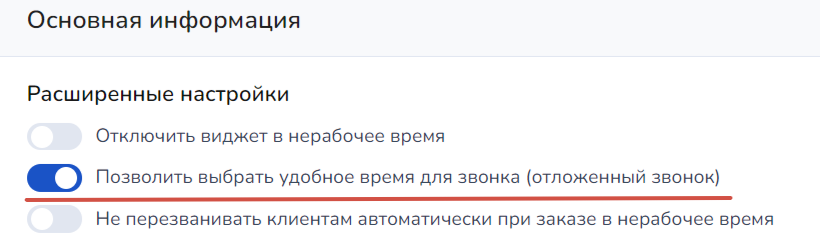<figcaption></figcaption></figure>

Чтобы настроить график работы, достаточно воспользоваться данными настройками:

<figure>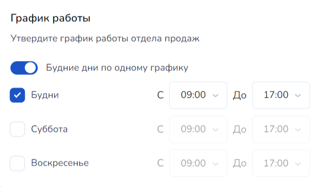<figcaption></figcaption></figure>

Вы можете настроить каждый будний день отдельно: для этого достаточно поставить ползунок в неактивное положение:

<figure>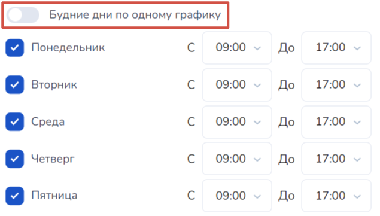<figcaption></figcaption></figure>

## Внешний вид

<figure>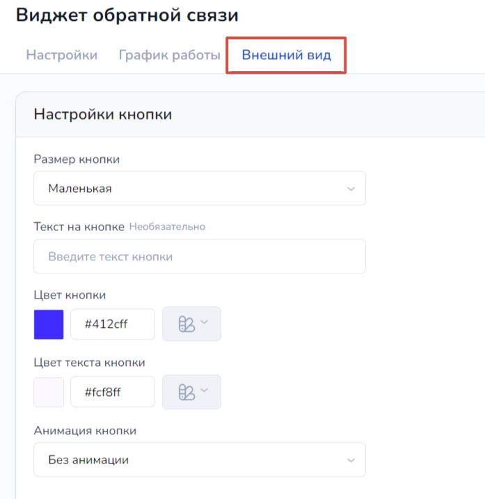<figcaption></figcaption></figure>

Настройки внешнего вида можно подразделить на настройки кнопки и настройки самого виджета.&#x20;

### Настройки кнопки

1. Размер кнопки: доступен выбор большой, средней и маленькой кнопки виджета:

<figure>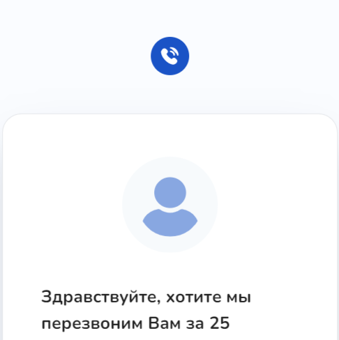<figcaption>
Маленькая
</figcaption></figure> <figure>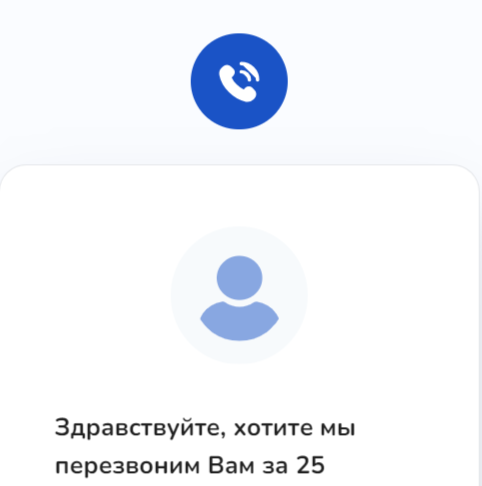<figcaption>
Средняя
</figcaption></figure> <figure>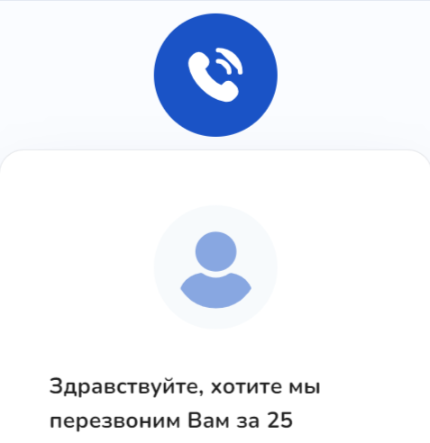<figcaption>
Большая
</figcaption></figure>

2. Текст на кнопке

<figure>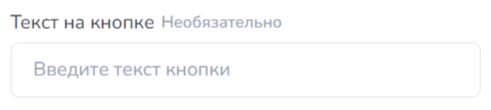<figcaption></figcaption></figure>

Вместо иконки телефона можно установить любой необходимый текст:

<figure><figcaption></figcaption></figure> <figure>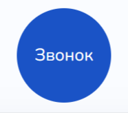<figcaption></figcaption></figure>

3. Цвет кнопки: с помощью обширной цветовой палитры выберите наиболее подходящий для вас цвет.

<figure>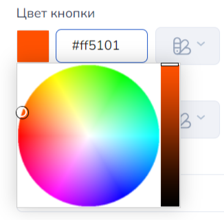<figcaption></figcaption></figure> <figure><figcaption></figcaption></figure>

4. Цвет текста кнопки: если вы заполнили пустое поле для текста, отображаемого на иконке виджета, то сможете изменить цветовую гамму текста:

<figure>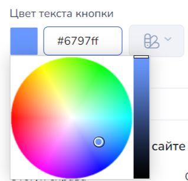<figcaption></figcaption></figure>

5. Анимация кнопки поможет украсить ваш сайт и сделать его более живым.

<figure>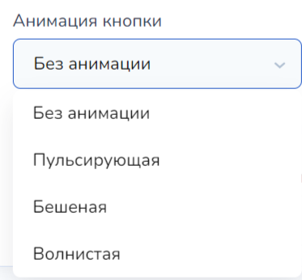<figcaption></figcaption></figure>

Как выглядит каждая из анимации для кнопки:

<figure><figcaption>
Волнистая
</figcaption></figure> <figure><figcaption>
Бешеная
</figcaption></figure> <figure><figcaption>
Пульсирующая
</figcaption></figure>

### Настройки виджета

После того, как вы разобрались с настройками внешнего вида кнопки, давайте приступим к содержанию и виду самого виджета.

<figure>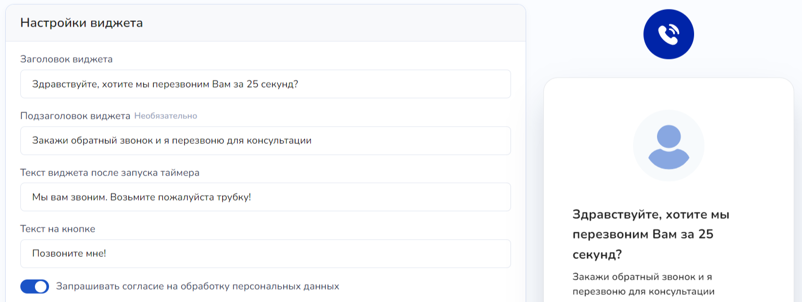<figcaption></figcaption></figure>

Для начала можно заполнить текстовые поля внутри виджета:

1. Заголовок

<figure>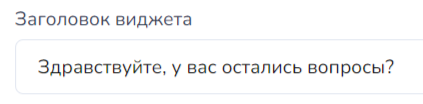<figcaption></figcaption></figure>

<figure>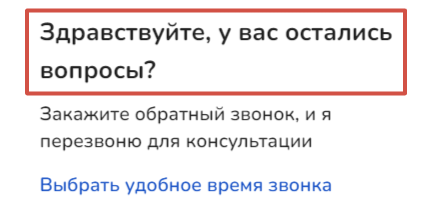<figcaption></figcaption></figure>

2. Подзаголовок:

<figure>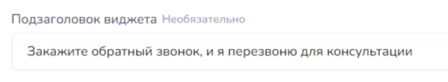<figcaption></figcaption></figure>

<figure>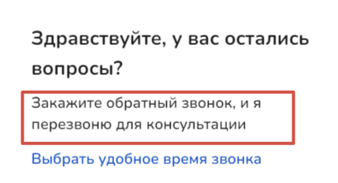<figcaption></figcaption></figure>


Данное поле является необязательным.


3. Текст виджета после запуска таймера:

<figure>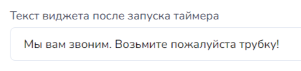<figcaption></figcaption></figure>

Текст отобразится в виджете только после того, как клиент нажмет на кнопку "Перезвоните мне" (или с любым другим текстом) во время отсчета таймера.

Таймер на виджете устанавливаете с помощью данной настройки:&#x20;

<figure>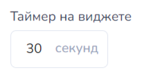<figcaption></figcaption></figure>

4. Текст на кнопке:

<figure>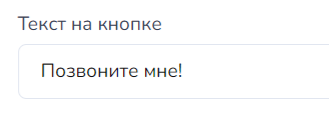<figcaption></figcaption></figure>

<figure>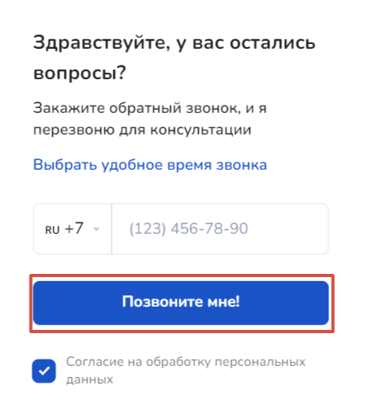<figcaption></figcaption></figure>

Аналогично любому текстовому редактору, текст внутри виджета можно выровнять относительно центра, левого и правого края с помощью данных кнопок:

<figure>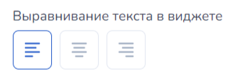<figcaption></figcaption></figure>

С помощью обширной цветовой палитры можно поиграть с тоном или градиентом для фона, цвета кнопок и даже установить узор:

<figure>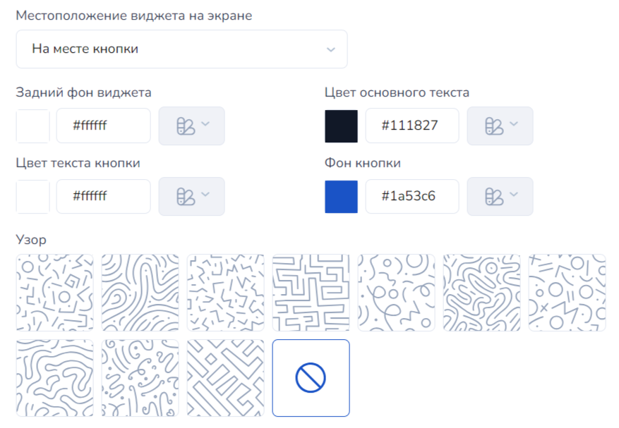<figcaption></figcaption></figure>

## Встраиваем виджет на сайт

После того, как вами были установлены все настройки и отредактирован внешний вид виджета по своему уникальному дизайну, нажмите на кнопку "Добавить виджет" внизу экрана:

<figure>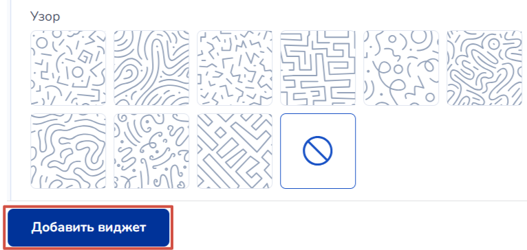<figcaption></figcaption></figure>

После чего вы перейдете в список уже готовых виджетов, где вам необходимо кликнуть по кнопке "Встроить код на сайт":

<figure>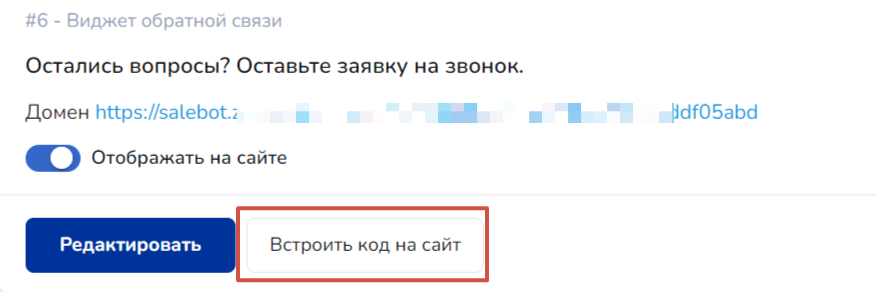<figcaption></figcaption></figure>

После чего вам откроется модальное окно со скриптом:

<figure><figcaption></figcaption></figure>

Скопируйте скрипт и перейдите в настройки сайта, домен которого указали в настройках виджета:

<figure><figcaption></figcaption></figure>

После чего вставьте скрипт в HTML-код head:

<figure><figcaption></figcaption></figure>


Чтобы встроить виджет на сайт тильды, также скопируйте скрипт виджета с помощью кнопки "Встроить код на сайт", после чего устанавливаете его на сайт.&#x20;


Готово! На этом настройка виджета и его установка на сайт завершена!&#x20;

## Коллбеки

Какие коллбеки существуют:

1. widget\_callback\_later widget\_id: 1 at 23.04.2024 18:00 - это отложенный звонок, где <mark style="color:green;">**widget\_callback\_later**</mark> - тело колбека; <mark style="color:yellow;">**widget\_id: 1 at 23.04.2024 18:00**</mark> - ID виджета, а также дата и время, когда необходимо осуществить звонок клиенту
2. widget\_callback\_need\_call widget\_id: 1 at 23.04.2024 18:00 - клиенту необходим звонок, где\
   <mark style="color:green;">**widget\_callback\_need\_call**</mark> - тело колбека; <mark style="color:yellow;">**widget\_id: 1 at 23.04.2024 18:00**</mark> - ID виджета, а также дата и время, когда необходимо осуществить звонок клиенту
3. widget\_callback\_now widget\_id: 1 - колбек о необходимости звонка клиенту в данное время, где <mark style="color:green;">**widget\_callback\_now**</mark> - тело колбека;  <mark style="color:yellow;">**widget\_id: 1**</mark>  - ID виджета;
4. widget\_callback\_need\_call - колбек о необходимости звонка. Приходит, если включена настройка:

<figure>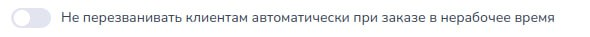<figcaption></figcaption></figure>

5. widget\_callback\_now - колбек текущий звонок.
