# Виджет "Стадный инстинкт"

Виджет "Стадного инстинкта" имитирует заказы/покупки вашего товара на сайте, отображаясь всплывающими окнами:&#x20;

<figure><figcaption></figcaption></figure>

Виджет работает по принципу "клиент **заметил**, что другие пользователи покупают, тоже **захотел** и **купил**".&#x20;

Основные плюсы использования такого виджета на сайте:

1. Мгновенно привлекает новых клиентов за счет импульсивных решений – многим людям нравится и хочется подражать другим.
2. Увеличивает доверие и преданность клиентов за счет множества заказов на Вашем сайте -  клиенты охотнее доверяют магазинам/сервисам, у которых уже есть достаточная аудитория клиентов.
3. Информирует клиентов о значимых событиях и предложениях: вы можете настроить частоту и аудиторию показа виджета по разным параметрам.

## Создание и настройка виджета

Чтобы создать виджет, перейдите в соответствующую вкладку "Виджеты":

<figure><figcaption></figcaption></figure>

Далее кликните по кнопке "Создать виджет":

<figure><figcaption></figcaption></figure>

Откроется выпадающий список с доступными для внедрения на сайт виджетами, среди которого выберите необходимый:

<figure><figcaption></figcaption></figure>

После чего вы перейдете в настройки виджета:

<figure><figcaption></figcaption></figure>

### Основная информация

#### Название виджета

В настройках поля "Название виджета" пропишите наименование для вашего виджета:

<figure><figcaption></figcaption></figure>


Название виджета является обязательным полем и будет отображаться только в разделе "Виджеты", но не будет видимым для ваших клиентов.&#x20;


#### Домен

Это второе обязательное поле, где необходимо указать домен сайта:

<figure><figcaption></figcaption></figure>

Это может быть как сайт, спроектированный на Salebot, так и на сервисе Тильда, а также на свой собственный.&#x20;

### Общие настройки контента

Общие настройки контента, определяют, что будет отображено в всплывающих уведомлениях виджета на сайте

<figure><figcaption></figcaption></figure>


Обратите внимание на конструкцию \[name], \[city] и пр.: они понадобятся для написания сообщения внутри виджета во вкладке "[Варианты виджета](vidzhet-stadnyi-instinkt.md#varianty-vidzheta)".&#x20;


#### Подстановка имени

Поля подстановки имени помогут отображать конкретно только мужские или только женские имена на сайте:

<figure><figcaption></figcaption></figure> <figure><figcaption></figcaption></figure>

Для изменения имен на мужские или женские воспользуйтесь соответствующим полем:

<figure><figcaption></figcaption></figure>

Также можно подобрать имена по территориальному расположению:

<figure><figcaption></figcaption></figure>

Тогда выборка имен будет изменена:

<figure><figcaption></figcaption></figure>

#### Подстановка города

Для своего сайта вы можете выбрать также и страну, города которой будут отображены в виджете:

<figure><figcaption></figcaption></figure>

Примеры:

1. Выбор "Россия":

<figure><figcaption></figcaption></figure>

2. Выбор "Беларусь":

<figure><figcaption></figcaption></figure>

3. Выбор "Казахстан":

<figure><figcaption></figcaption></figure>

#### Подстановка суммы

В текстовый блок виджета можно встроить сумму для отображения, причем сумма может быть как точная, так и рандомная по заданному диапазону:

<figure><figcaption></figcaption></figure>

Для ввода точной суммы воспользуйтесь пустым полем справа:

<figure><figcaption></figcaption></figure>

Если вы выберите тип "сумма из диапазона", то необходимо ввести в поля интервалы  для выборки рандомного числа строго от и до:

<figure><figcaption></figcaption></figure>

Также при необходимости установите округление числа после запятой:

<figure><figcaption></figcaption></figure>

### Подстановка пользовательских переменных

Чтобы подставить в виджет собственные переменные, необходимо воспользоваться кнопкой "Добавить переменную":

<figure><figcaption></figcaption></figure>

Далее откроется модальное окно, в котором необходимо задать наименование переменной <mark style="color:green;">**через квадратные скобки**</mark>:

<figure><figcaption></figcaption></figure>

Далее введите значение переменной, где каждое новое значение должно быть написано с НОВОЙ строки без запятых и иных разделительных знаков:

<figure><figcaption></figcaption></figure>

Далее нажмите на "Сохранить", чтобы значения сохранились в системе:

<figure><figcaption></figcaption></figure>

Далее вы увидите, что пользовательская переменная сохранилась в общих настройках контента:

<figure><figcaption></figcaption></figure>

Чтобы в дальнейшем использовать переменную, необходимо будет подставить наименование переменной через квадратный скобки в поле "Основной текст" в разделе "Контент":

<figure><figcaption></figcaption></figure>

### Условия срабатывания виджета

<figure>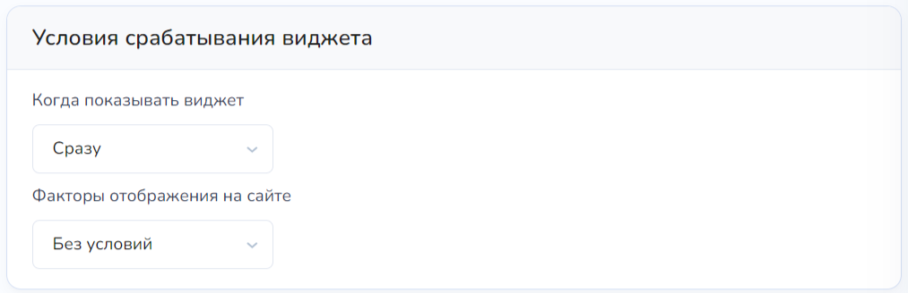<figcaption></figcaption></figure>

#### Временной интервал

Можно установить тайминг показа виджета на сайте. Для этого воспользуйтесь функцией "Когда показывать виджет":

1. **Сразу**\
   Данная настройка отобразит виджет в момент перехода пользователя на сайт.&#x20;
2. **Спустя время**

<figure>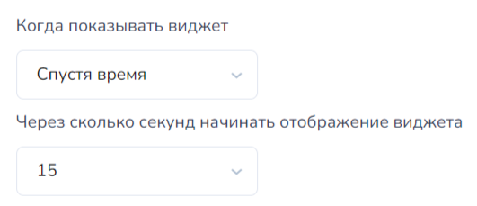<figcaption></figcaption></figure>

Виджет отобразится на сайте по прошествию определенного количества секунд после того, как клиент перешел на сайт.

Устанавливается временной интервал в секундах, где минимальное значение - 1 секунда, а максимальное  - 15 секунд.

3. **После прокрутки**

<figure><figcaption></figcaption></figure>

Условие "После прокрутки" обозначает, что виджеты начнут работать на сайте после того, как ваш пользователь пролистнет расстояние в установленное количество пикселей.

#### Временной интервал

Также в условиях срабатывания существует:

1. Продолжительность показа:\
   \- Устанавливается значение в секундах. \
   \- Обозначает, что виджет покажется ровно на установленное количество секунд, затем уведомление пропадет из виду.
2. Интервал между показами\
   \- Устаналивается значение в секундах.\
   \- Обозначает, что после показа уведомления (виджета) по прошествию заданного количества секунд покажется следующий виджет.&#x20;

<figure><figcaption></figcaption></figure>

#### Задать условие

&#x20;Разберем подробнее существующие условия.

1. UTM-метки


Чтобы узнать, что такое UTM-метки и как ими пользоваться, рекомендуем прочитать статью "[Как передать параметры и UTM-метки](https://docs.salebot.pro/minilendingi-v-socialnykh-setyakh/kak-peredat-parametry-i-utm-metki)".


<figure>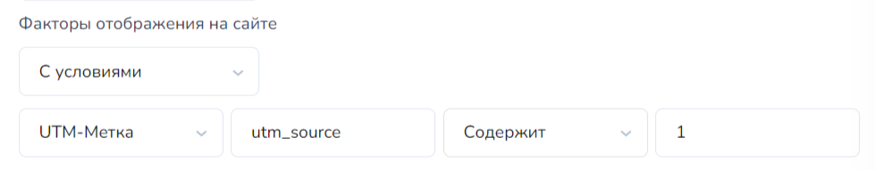<figcaption></figcaption></figure>

В соответствующем поле пропишите название необходимой метки:

<figure>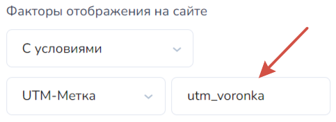<figcaption></figcaption></figure>

Далее выберите оператор соответствия метки значению:

<figure>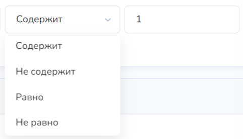<figcaption></figcaption></figure>


В чем разница содержит/не содержит и равно/не равно?

Основное различие в том, что "**содержит/не содержит**" проверяет значение на факт того, что UTM-метка включает (или не включает) то или иное значение. \
Тогда как оператор "**равно**" строго присваивает значение, в связи с чем система ищет совпадение в UTM-метке по строгому значению (соответственно "Не равно" противоположно).


После чего пропишите необходимое значение для UTM-метки:

<figure>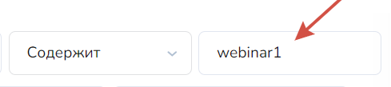<figcaption></figcaption></figure>

2. Страна

<figure>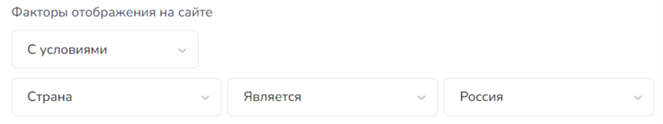<figcaption></figcaption></figure>

Также можно выбрать условие "Страна", которое отобразит виджет в зависимости от IP страны подключения. \
Выберите необходимую страну из перечня, а также тип оператора (является или не является):

<figure>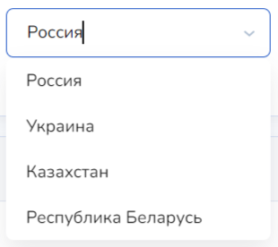<figcaption></figcaption></figure>

3. Устройство

<figure>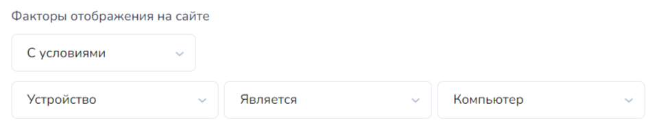<figcaption></figcaption></figure>

При необходимости установите условие "Устройство", которое отобразит виджет в зависимости от типа устройства клиента, перешедшего на сайт:

<figure>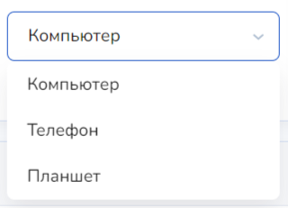<figcaption></figcaption></figure> <figure>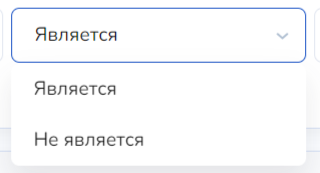<figcaption></figcaption></figure>

В настройках также существует функция для добавления нескольких значений для отображения виджета. Для этого достаточно кликнуть по "+ Добавить значение" и установить еще одно или несколько необходимых условий:

<figure>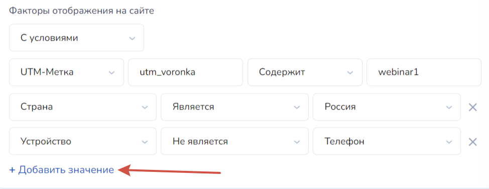<figcaption></figcaption></figure>

## Варианты виджета

После того как вы закончили с настройками виджета, переходите во вкладку "Варианты виджета":

<figure><figcaption></figcaption></figure>

В данной вкладке устанавливаются настройки внешнего вида и содержания виджета, которое отображается вашим пользователям.&#x20;

### Контент

<figure><figcaption></figcaption></figure>

В полях "Заголовок" и "Основной текст" вы можете прописать значения, [установленные в настройках виджета](vidzhet-stadnyi-instinkt.md#obshie-nastroiki-kontenta):

<figure><figcaption></figcaption></figure> <figure><figcaption></figcaption></figure>

Вместо переменных \[name], \[sum], \[city] подтянутся значения, которые вы установили в настройках виджета.&#x20;

#### Иконка

<figure><figcaption></figcaption></figure>

Иконка будет отображена внутри всплывающего уведомления:

<figure><figcaption></figcaption></figure>

### Внешний вид

Настройки внешнего вида традиционно представляют собой выборку цвета из обширной палитры, скругления углов, настройку тени и прозрачности:

<figure><figcaption></figcaption></figure>

1. Цветовая палитра: можно выбрать цвет для любого элемента виджета, начиная от текста, заканчивая фоном иконки, а также выбрать градиент:

<figure><figcaption></figcaption></figure>

2. Выравнивание текста происходит относительно середины, правого или левого края:

<figure><figcaption></figcaption></figure>

2. Настройка углов уведомления: можно выбрать скругленные, квадратные или круглые углы сообщения на сайте:

<figure><figcaption></figcaption></figure>

#### Скрыть кнопку закрытия виджета

<figure><figcaption></figcaption></figure>

Данный чекбокс скроет крестик в углу виджета:

<figure><figcaption></figcaption></figure>

### Положение виджета на сайте

Положение уведомлений уже по умолчанию установлено внизу в правом углу экрана:

<figure><figcaption></figcaption></figure>

При необходимости переместите виджет в другое местоположение на сайте, воспользовавшись данными настройками:

<figure><figcaption></figcaption></figure>

Регулирование положения виджета происходит относительно нижнего и правого края.&#x20;

Можно сместить виджет в левый край, установив значение, например, в поле "Отступ справа" - 60%:

Пример отображения виджета:

<figure><figcaption></figcaption></figure>

Настройки:

<figure><figcaption></figcaption></figure>

## Как встроить виджет на сайт

После того, как вами были установлены все настройки и отредактирован внешний вид виджета по своему уникальному дизайну, нажмите на кнопку "Добавить виджет" внизу экрана:

<figure><figcaption></figcaption></figure>

После чего вы перейдете в список уже готовых виджетов, где вам необходимо кликнуть по кнопке "Встроить код на сайт":

<figure><figcaption></figcaption></figure>

После чего вам откроется модальное окно со скриптом:

<figure>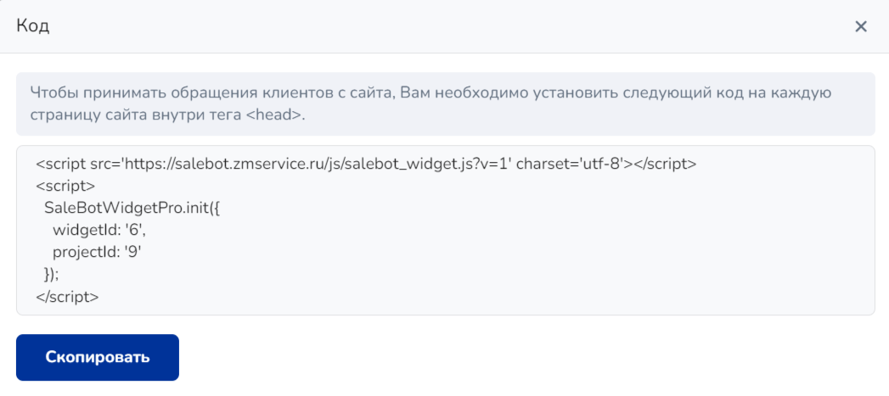<figcaption></figcaption></figure>

Скопируйте скрипт и перейдите в настройки сайта, домен которого указали в настройках виджета:

<figure>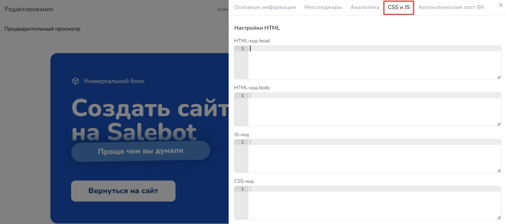<figcaption></figcaption></figure>

После чего вставьте скрипт в HTML-код head:

<figure>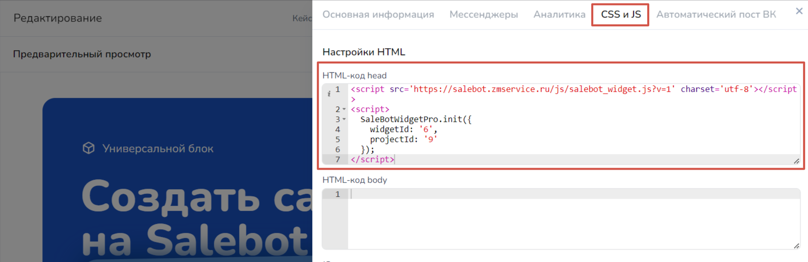<figcaption></figcaption></figure>


Чтобы встроить виджет на сайт тильды, также скопируйте скрипт виджета с помощью кнопки "Встроить код на сайт", после чего устанавливаете его на сайт.&#x20;


Готово! На этом настройка виджета и его установка на сайт завершена!&#x20;
