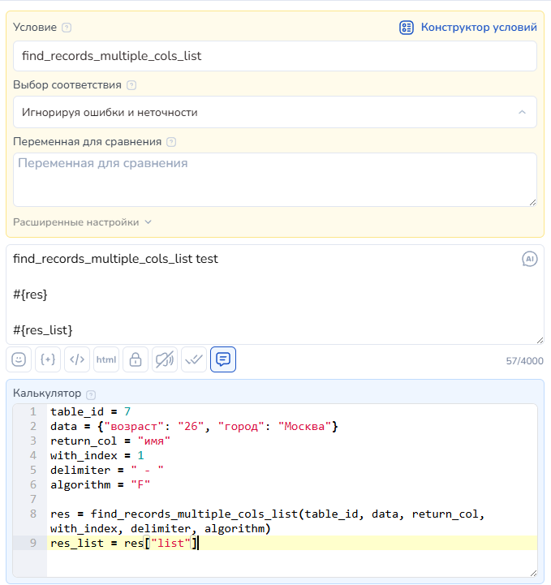
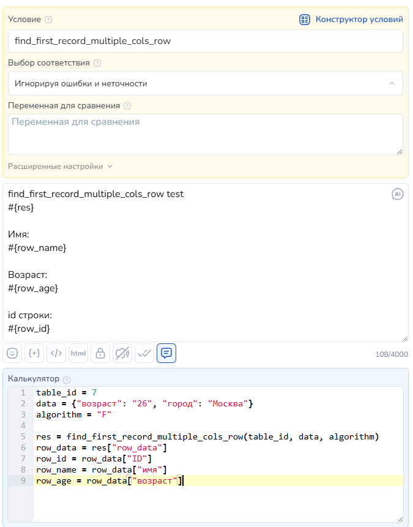

# Таблицы в Salebot

**Раздел «Таблицы» в Сейлбот**— инструмент для удобного хранения и управления данными внутри платформы. Теперь не нужно переключаться между разными сервисами : все таблицы доступны в одном проекте.

<figure><figcaption></figcaption></figure>

**Возможности:**

* Создание таблиц с любым количеством строк и столбцов.
* Хранение и редактирование данных без сторонних инструментов и сервисов.&#x20;
* Ввод значений, редактирование строк и столбцов или удаление через чат-бота с помощью функций

**Преимущества:**\
&#xNAN;**✔ Упрощает работу с данными:** вводить информацию в таблицу можно прямо из бота. \
✔ **Гибкость и простота** – создавайте столько таблиц, сколько нужно, настраивайте их под свои бизнес-задачи.\
&#xNAN;**✔ Возможность управлять таблицами без выхода из Salebot.**

Таблицы помогают бизнесу структурировать данные и ускорить процессы.

## Как создать таблицу

Для начала перейдите в раздел таблицы в необходимом проекте:

<figure><figcaption></figcaption></figure>

Далее вы увидите кнопку "Добавить таблицу", кликнув по которой откроется модальное окошко, в котором нужно ввести название таблицы:

<figure><figcaption></figcaption></figure> <figure><figcaption></figcaption></figure>

Пропишите название для таблицы и кликните на кнопку "Готово". Тогда новая таблица будет создана в проекте и появится в разделе "Таблицы":

<figure><figcaption></figcaption></figure>

### Настройки таблицы

После того как вы создали таблицу, необходимо добавить строки и колонки. Для этого на плашке нужной таблицы найдите кнопку "Перейти" и кликните по ней:

<figure><figcaption></figcaption></figure>

Вы увидите следующие настройки:

<figure><figcaption></figcaption></figure>

1. Функция для добавления столбцов:

а) Для добавления буквенных столбцов:

<figure><figcaption></figcaption></figure>

При клике на кнопку в таблицу добавятся столбцы с обозначением от A до Z.&#x20;

<figure><figcaption></figcaption></figure>

б) для добавления столбцов с названиями:

<figure><figcaption></figcaption></figure>

при клике на кнопку появится модальное окно, в котором нужно прописать название для добавляемого столбца:

<figure><figcaption></figcaption></figure>

После того как вы прописали название столбца, кликните по кнопке "Готово", тогда новый столбец добавится в таблицу:

<figure><figcaption></figcaption></figure>

2. Кнопка для добавления строк в таблицу:

а) можно добавить фиксированное количество строк (100) в таблицу:

<figure><figcaption></figcaption></figure>

б) или заданное количество строк:&#x20;

<figure><figcaption></figcaption></figure>

3. Экспорт таблицы

<figure><figcaption></figcaption></figure>

Поможет экспортировать таблицу в формате csv со всеми данными и значениями, например, чтобы перенести таблицу в другой проект Сейлбот или в другой сервис для таблиц.

4. Импорт таблицы - для загрузки таблицы из иных сервисов.&#x20;

<figure><figcaption></figcaption></figure>

### Другие возможности

Существует выпадающее меню, с помощью которого вы быстро можете просматривать таблицы, не выходя в основной раздел.&#x20;

<figure><figcaption></figcaption></figure>

Также можно создавать новые таблицы при открытии бокового меню.&#x20;

Чтобы удалить таблицу, перейдите в основной раздел:

<figure><figcaption></figcaption></figure>

И на плашке с ненужной таблицей найдите кнопку для удаления.&#x20;


Внимание!&#x20;

Восстановить удаленную таблицу нельзя.&#x20;


## Как вводить значения в таблицу

Вводить значения в таблицу можно вручную:

<figure><figcaption></figcaption></figure>

Также с помощью функций в чат-боте.&#x20;

### Где найти ID таблицы?

Чтобы работать с функциями для чат-бота, понадобится ID таблицы.

Для начала перейдите в нужную таблицу: для этого найдите в списке искомую таблицу и кликните по ней:

<figure><figcaption></figcaption></figure>

Далее кликните по адресной строке:

<figure><figcaption></figcaption></figure>

В адресной строке вы увидите адрес вида "https://salebot.pro/projects/11111/table/<mark style="color:red;">**2**</mark>", где найдете ID нужной таблицы:

<figure><figcaption></figcaption></figure>

### Создать новую запись в таблице

new\_record(table\_id, data) - создать новую запись в таблице с указанными значениями.

\- table\_id - id таблицы

\- data - словарь с данными, которые нужно записать. пример: {"column\_name1": "value1", "column\_name2": "value2"}. Если колонка не существует, она создается

Ответ: ID новой записи

### Пример

<figure><figcaption></figcaption></figure>

### Редактировать существующую запись в таблице

edit\_record(table\_id, record\_id, data)

\- table\_id - id таблицы

\- record\_id - id редактируемой записи

\- data - словарь с данными, которые нужно изменить. пример: {"column\_name1": "value3", "column\_name2": "value4"}. Если колонка не существует, она НЕ создается

Ответ:

Возвращает полные данные по отредактированной записи в формате {"column\_name1": "value3", "column\_name2": "value4"}

### Пример

<figure><figcaption></figcaption></figure>

### Удалить запись из таблицы по id записи

delete\_record(table\_id, record\_id)

\- table\_id - id таблицы

\- record\_id - id записи на удаление

Ответ:

{'message': 'Удалено записей: 1'}

### Найти первую запись по указанному значению в таблице

Найти первую запись по указанному значению в таблице

find\_record(table\_id, value, find\_in, return\_from)

\- table\_id - id таблицы

\- value - значение, по которому ищем совпадение

\- find\_in - необязательный параметр. Название столбца, по которому ведём поиск. если не указан, ищем запись по всем столбцам

\- return\_from - необязательный параметр. Название столбца из которого нужно вернуть значение.&#x20;

Ответ:

Если return\_from указан, вернется значение указанного столбца, если он есть в таблице. Если return\_from не указан или такого столбца нет, в ответе будут полные данные по найденной записи {"column\_name1": "value3", "column\_name2": "value4"}

### Пример

<figure><figcaption></figcaption></figure>

### Получить значения из указанной записи

get\_record\_data(table\_id, record\_id, return\_column )&#x20;

\- table\_id - id таблицы

\- record\_id - id записи, из которой берем значения

\- return\_column - необязательный параметр. Название столбца из которого нужно вернуть значение.

Ответ: Если запись найдена, возвращает словарь типа {"column\_name1": "value1", "column\_name2": "value2"}. Если при этом передан параметр return\_column и такой столбец существует, в ответе будет значение только по этому столбцу.

### Получение всех значений при поиске по нескольким колонкам&#x20;

find\_records\_multiple\_cols\_list(table\_id, column\_data, return\_col, with\_index, delimiter, algorithm) — Если возникла необходимость искать по нескольким колонкам сразу и получить список значений из колонки в строках, в которых будут найдены все значения, то нужно использовать следующую функцию (аналог функции sheet\_search\_in\_multiple\_cols\_return\_list для гугл таблиц)

• table\_id — id таблицы

• column\_data — поисковый запрос, то что нужно найти

• return\_col — номер колонки, из которой нужно вернуть значения

• with\_index — индекс или номер в списке найденных значений (0 - нумерация (1,2,3,…); 1 - индекс строки; "" - список значений с новой строки без индексов и нумерации)

• delimiter — разделитель между индексом и значением

• algorithm — алгоритм поиска (F - полное совпадение, K - наличие ключевых слов, R - регулярное выражение, 1-100 - процент похожести (подробнее выше))

Пример:

table\_id = 7

data = {"возраст": "26", "город": "Москва"}

return\_col = "имя"

with\_index = 1

delimiter = " - "

algorithm = "F"

res = find\_records\_multiple\_cols\_list(table\_id, data, return\_col, with\_index, delimiter, algorithm)

res\_list = res\["list"]

<figure><figcaption></figcaption></figure>

<figure><figcaption></figcaption></figure>

Если проблем при выполнении запроса не возникло, то в ответ приходит словарь содержащий статус и все ячейки со значениями&#x20;

{"status":true,"rows\_index":\[2,3],"quantity":2,"list":"2 - Илья\n3 - Раиса"}

• status — результат поиска

• rows\_index — массив с номерами найденных строк

• quantity — количество найденных строк

• list — строка со всеми значениями из выбранного столбца

Если возникла ошибка, то вернется статус false и описание ошибки {"status":false,"error":"Ошибка или описание"}

### Получение первого значения при поиске по нескольким колонкам

find\_first\_record\_multiple\_cols\_row(table\_id, column\_data, algorithm) — Если возникла необходимость искать по нескольким колонкам сразу и получить первую найденную строку, то нужно использовать следующую функцию (Аналог функции sheet\_search\_in\_multiple\_cols\_return\_row для гугл таблиц)

• table\_id — ид таблицы

• columns — поисковый запрос, то что нужно найти

• algorithm — алгоритм поиска (F - полное совпадение, K - наличие ключевых слов, R - регулярное выражение, 1-100 - процент похожести (подробнее выше))

Пример

table\_id = 7

data = {"возраст": "26", "город": "Москва"}

algorithm = "F"

res = find\_first\_record\_multiple\_cols\_row(table\_id, data, algorithm)

row\_data = res\["row\_data"]

row\_id = row\_data\["ID"]

row\_name = row\_data\["имя"]

row\_age = row\_data\["возраст"]

<figure><figcaption></figcaption></figure>

<figure><figcaption></figcaption></figure>

Если проблем при выполнении запроса не возникло, то в ответ приходит словарь содержащий статус и все ячейки со значениями&#x20;

{"status":true,"rows\_index":\[2,3],"quantity":2,"row\_data":{"ID":2,"имя":"Илья","возраст":"26","город":"Москва"},"row":2}

• status — результат поиска

• rows\_index — массив с номерами найденных строк

• row\_data — данные из найденной строки

• row — номер найденной строки

Если возникла ошибка, то вернется статус false и описание ошибки {"status":false,"error":"Ошибка или описание"}
